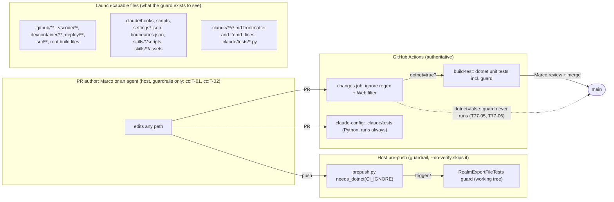

<!-- gate: G3 | verdict: PASS-WITH-NOTES | issue: #77 -->
# Threat delta: scope the realm-file guard and widen the .NET trigger (issue #77)

- Scope: two changes Marco chose on 2026-09-27 (manifest `docs/ai/pipeline/77.md`):
  1. **Scope the guard.** `RealmExportFileTests.The_realm_file_name_is_referenced_only_from_the_AppHost_tests_and_docs` (G4-17-12, T-02 in `keycloak-realm.md`) lets `.claude/**` documentation and tests name `decisya-realm.json`.
  2. **Widen the trigger.** CI's `changes` job (`.github/workflows/ci.yml`) and `.claude/scripts/prepush.py` run the .NET build and unit tests when `.claude/**` changes. `docs/**` stays excluded.
- Baselines: `keycloak-realm.md` (#17, T-02, G4-17-12, F-1 = #29), `pre-push-ci-parity.md` (#59, G4-59-04), `roster-docs.md` (#76; review 76 recorded the trigger gap as Info), `claude-config.md` (cc:T-01, cc:T-02). New threats use T77-xx. Requirements use G4-77-xx.
- What the guard protects: the dev realm seeds a cross-tenant `platform-admin` and users sharing one dev password, and Keycloak silently keeps an unresolved placeholder as the literal secret (#17 T-01). Only two reviewed launch paths exist: the AppHost and the Testcontainers fixture. Every other launch path belongs to #29, the production realm. The guard is a **detective** control: it works only if it runs on every change that could add a launch path.
- Boundary: this is a host run. No Decisya application trust boundary changes. The trust boundary that matters here is **PR author (human or agent) → main**, enforced by CI and Marco's review. The pre-push hook is a guardrail (`git push --no-verify`).
- ASVS 5.0 is mapped by analogy at section level, as in the baselines: V13.1 configuration documentation, V13.2 backend configuration, V15.1 secure-coding documentation, V15.2 dependencies and architecture, V15.3 defensive coding. Check the numbers against the official 5.0 text before copying them into a compliance artefact.
- Reviewer: security-reviewer agent, 2026-09-27. Mode: G3, before G4. The evidence comes from reading the code on `issue/77-realm-guard-scope` at `0f43d0f`.

## Verdict

**PASS-WITH-NOTES.** Both changes are sound in intent. As worded in the issue ("allow `.claude/**` documentation and tests"; "`.claude/**` triggers .NET"), three Highs remain open. Each is closed by a MUST below.

1. **`.claude/` is not documentation (T77-01, High).** `.claude/hooks/**` and `.claude/scripts/**` are Python that runs on every tool call or push. `.claude/settings*.json` holds hook commands. `.claude/boundaries.json` is enforcement config. `.claude/skills/*/scripts/**` runs from skills. `.claude/skills/module-scaffold/assets/*.csproj|*.cs` are templates that `scaffold.py` copies into `src/`. A directory-wide exemption would therefore reopen exactly the paths G4-17-12 was written to close. The exemption must be `*.md` prose plus `.claude/tests/**`, nothing wider (G4-77-01, 02).
2. **A launch-kind allow-list fails open (T77-03, High if chosen).** The planned "e.g." list misses `.vscode/tasks.json` and `launch.json`, `Directory.Build.targets` (MSBuild `Exec`), `.pre-commit-config.yaml`, `package.json` scripts, `Makefile`, `justfile`, `Taskfile.yml`, `*.bicep`, `*.tf`, Kubernetes or Helm YAML, `azure.yaml`, `dotnet-tools.json`, `.claude/settings.json` and every kind nobody has invented yet. Keep **scan everything, exempt a short named list** (G4-77-03).
3. **The trigger has more holes than `.claude/` (T77-05, High).** CI's ignore regex also skips `\.md$` anywhere (which covers `.claude/**/*.md`, the #74 file class), `^\.vscode/` and `.github/workflows/claude-review.yml`. The guard scans all three, and two are launch-capable. Removing only `^\.claude/` leaves `.claude/skills/x/SKILL.md` untriggered. That is precisely the #74 incident. The invariant must be **guard scope ⊆ trigger**, proved by a test (G4-77-05 to 07).

Other findings:

- **Markdown under `.claude/` can execute (T77-02, Medium).** Claude Code reads YAML frontmatter in agents and skills (tools, model and, in current versions, `hooks:`). Skill bodies can carry `` !`cmd` `` inline shell that runs when the skill loads. The `.md` exemption must stop at prose (G4-77-02).
- **`.claude/tests/**` is executable Python** that CI (`claude-config`) and the pre-push hook run (T77-04, Medium). It may name the file, but not in the same file as a Keycloak import marker (G4-77-04).
- **Parity is currently checked by string equality only** (T77-07, Medium). CI's lane logic has more shell steps than `CI_IGNORE`. Both sides must be checked by behaviour on a shared path table (G4-77-08).
- **Two pre-existing gaps, not introduced by #77.** First, `src/Decisya.Web/**` changes never run the .NET lane (T77-06). Second, the needle is only the exact file name, so a mount of the `deploy/keycloak` **directory** with `--import-realm` never names the file (T77-09). SHOULD items, or link them to #29 (F-77-1, F-77-2).

No High is left without a mitigation. G6 checks every MUST against the diff.

## Evidence (code reading, 2026-09-27)

- `RealmExportFileTests.cs:197-251`:
  - enumerates the whole working tree (tracked, untracked and git-ignored files) except paths containing `.git/`;
  - exempts `AppHost.cs`, `decisya.slnx`, and every path that starts with `tests` or `docs` (a `StartsWith` prefix match on the absolute path with no trailing separator, so `tests-foo/` or `docs.old/` would also be exempt; Low, T77-11);
  - matches with a case-sensitive `Ordinal` `Contains`;
  - silently skips files that throw `IOException` or `UnauthorizedAccessException`.
- `ci.yml:52`: `ignore='^docs/|\.md$|^\.claude/|^\.vscode/|^LICENSE$|^\.github/(ISSUE_TEMPLATE/|dependabot\.yml$|workflows/claude-review\.yml$)'`.
  - `ci.yml:55`: `dotnet_changed` also drops `^src/Decisya\.Web/` and `^\.node-version$`, so a Web-only change never runs .NET.
  - `ci.yml:39`: an unknown base sets `changed=ALL`, which runs everything (fail closed).
- `prepush.py:41-42` copies the ignore regex. `needs_dotnet` applies only that regex. It does **not** apply CI's second filter (`src/Decisya.Web/`, `.node-version`), so today a Web-only push runs the host .NET build while CI skips it. The hook is stricter, so this is not a safety gap, but it is proof that string parity is not behaviour parity.
- `test_prepush.py:41-48`:
  - `test_ignore_regex_matches_ci` compares strings only;
  - `test_docs_only_push_skips_dotnet` asserts that `.claude/scripts/lint.py` **skips** .NET. Change 2 must invert that assertion, and G6 will check that the edit is exactly that.
- Tracked `.claude/` content that is executable or enforcement config: `hooks/{_hooklib,agent_boundaries,secret_guard}.py`, `scripts/*.py` (7 files), `settings.json` (two `"command"` hooks, lines 70 and 80), `boundaries.json`, `skills/module-scaffold/scripts/scaffold.py`, and `skills/module-scaffold/assets/{Module.cs,ModuleBoundaryTests.cs,*.csproj}`. `.claude/settings.local.json` is git-ignored (`.gitignore:15`) but exists on the host, and the guard scans it locally.
- Today no file under `.claude/` names the realm file. #76 replaced the `test_agent_roster.py` rows with `deploy/keycloak/example.json` and reworded `skills/keycloak/SKILL.md`. So #77 does not need to allow any current file. It adds a permission for the future.
- `.vscode/settings.json` sets `task.allowAutomaticTasks: off`. A committed `tasks.json` still runs on a manual "Run Task", and `launch.json` on F5.
- Needle coverage: `ContainerImages.cs:23` mentions `--import-realm` in a comment, `boundaries.json` names `deploy/keycloak/**`, and the architecture note (`keycloak-realm.md:79`) chose the file name so that a **directory** import also works. A directory import never names the file.

## Data flow and trust boundaries (delta)



Boundary B1, author → main: the guard is the only automated control against a new dev-realm launch path (T-02). It holds only if the **scope** covers every launch-capable file (T77-01 to 04) **and** the **trigger** fires whenever an in-scope file changes (T77-05 to 07).

## Threats

| Id | Element / flow | STRIDE | Threat | Severity | Mitigation | ASVS 5.0 id | Status |
| --- | --- | --- | --- | --- | --- | --- | --- |
| T77-01 | Guard scope, `.claude/**` | T, E | A directory-wide exemption lets a hook, script, `settings*.json` hook command, `boundaries.json`, skill script or scaffold asset name the realm file and launch Keycloak with the dev realm (seeded `platform-admin`, shared password, placeholder fail-open #17 T-01), or copy it into `src/` through `scaffold.py`. The old full scan caught every one of these. | High (as worded) | The exemption covers only `.claude/**/*.md` prose and `.claude/tests/**`; everything else under `.claude/` stays scanned (G4-77-01). Red and regression rows (G4-77-10). | V13.2, V15.2, V15.3 | Mitigated by requirements |
| T77-02 | Guard scope, `.claude/**/*.md` | T, E | Markdown under `.claude/` executes. Frontmatter configures agents and skills (tools, `hooks:`), and a skill body's `` !`cmd` `` line runs shell when the skill loads. Either can launch the realm while the name sits in an "exempt" `.md`. Prose can also instruct an agent to `docker run` with the file; the second layer there is `agent_boundaries.py`'s Docker deny, which is a guardrail only (cc:T-02). | Medium | The `.md` exemption stops at the frontmatter block and at any line containing `` !` `` (G4-77-02). | V13.2, V15.3 | Mitigated by requirements |
| T77-03 | Guard design | T | Scanning only an allow-list of "launch kinds" fails open for every kind not listed (`.vscode/tasks.json`, `launch.json`, `Directory.Build.targets` `Exec`, `.pre-commit-config.yaml`, `package.json` scripts, `Makefile`, IaC, `.claude/settings.json`, and future kinds). | High (if chosen) | Keep the current structure: scan everything, with a short named exemption list (G4-77-03). | V15.3 | Mitigated by requirements |
| T77-04 | Guard scope, `.claude/tests/**` | E | `.claude/tests/*.py` is executed by CI `claude-config` and by the pre-push hook. A test that names the file can start Keycloak with it (`subprocess`, `docker`), a launch path outside the reviewed fixture. | Medium | A `.claude/tests` file that names the realm file must not also contain a Keycloak import marker (G4-77-04). Residual: indirection through a helper in `.claude/scripts` that never names the file stays Low; `scripts/` is scanned and review-required (#76 G4-76-22). | V15.3 | Mitigated by requirements |
| T77-05 | Trigger, CI `changes` + `prepush.py` | T, R | An in-scope file changes, but the .NET lane is skipped, so a violation merges and main goes red later (the #74 class). As planned, the gap persists for `.claude/**/*.md` (via `\.md$`), `.vscode/**` (launch-capable) and `.github/workflows/claude-review.yml` (a workflow). | High | The invariant **guard scope ⊆ trigger** holds, enforced by a test (G4-77-05, 06, 07). | V15.2, V13.1 | Mitigated by requirements |
| T77-06 | Trigger, `src/Decisya.Web/**` | T | CI's second filter keeps SPA-only changes out of the .NET lane. A `package.json` script or `vite.config.ts` naming the realm is never checked by CI. Pre-existing, and not caused by #77. | Medium | SHOULD G4-77-12, or follow-up F-77-1. | V15.2 | Mitigated (G4-77-12 taken: always-run `realm-guard` job; review 77) |
| T77-07 | Parity, CI ↔ pre-push | R | `test_ignore_regex_matches_ci` compares regex strings. CI's decision also depends on the Web filter, `ALL` and `ls *.slnx`. A future change to one side's shell logic diverges silently, which is how "the hook said OK, CI went red" or the reverse returns. | Medium | Behaviour parity: run the `changes` detect block in bash on a shared path table and compare it with `needs_dotnet` (G4-77-08). | V15.3 | Mitigated by requirements |
| T77-08 | Guard exemption list | T, R | Once the exemption list has a "`.claude` stuff" entry, later edits widen it quietly (review evasion). Test edits live in the identity-dev lane and run under host guardrails. | Medium | The exemption list is pinned by a meta-test, and the failure message states the rule (G4-77-09). G6 diffs the list. | V15.1, V15.3 | Mitigated by requirements |
| T77-09 | Guard needle | T | The needle is the exact, case-sensitive file name. A directory mount of `deploy/keycloak` with `--import-realm` (the name was chosen to make this work), a case variant on NTFS (`Decisya-Realm.json`), or a split string (`"decisya-" + "realm.json"`) all launch the dev realm unseen. Pre-existing. | Medium | SHOULD G4-77-13, or #29 (F-1) carries it (F-77-2). | V15.3 | Partly mitigated (G4-77-13 taken: case-insensitive, import-directory needle); split strings and other mount targets stay with F-77-2 |
| T77-10 | Widened trigger, host build | E | `.claude`-only pushes now run `dotnet build` on the host, which executes repository MSBuild. | Low | No new capability: any push that touches code already does this, and the author can already run code as Marco (ADR-0011 H-1). Accepted. | V15.2 | Accepted |
| T77-11 | Guard implementation | T | The exemption uses a prefix match on the absolute path with no separator (`tests-x/`, `docs.old/` are exempt), and unreadable files are skipped silently. | Low | G4-77-03 (separator-anchored, relative-path matching). The skip-on-IOException stays, because locked files are not a launch path CI can see. | V15.3 | Mitigated by requirements |
| T77-12 | Trigger fallback | D, T | A rewrite of the detect block loses the `changed=ALL` fail-closed branch, so a force push or first push skips .NET. | Low | Regression row in G4-77-08 (`ALL` ⇒ dotnet=true). | V15.3 | Mitigated by requirements |

## Answers to the questions in the brief

- **What could an attacker or a mistake now do that the full scan caught?**
  - Add a `.claude` hook or script, a `settings*.json` hook command, `boundaries.json` content, a skill script, or a scaffold template that names and launches the dev realm (T77-01).
  - Put the launch in a skill's `` !`cmd` `` line or in agent or skill frontmatter (T77-02).
  - Write a `.claude/tests` Python test that starts a container with the realm (T77-04).
  - With the trigger as planned, do any of these in a `.md`, `.vscode` or `claude-review.yml`-only PR and merge before the guard runs (T77-05).
- **Which file kinds must stay in scope under `.claude/`?** Everything except `*.md` prose and `.claude/tests/**`, named explicitly:
  - `.claude/hooks/**`;
  - `.claude/scripts/**`;
  - `.claude/settings.json` and `.claude/settings.local.json` (scanned locally; git-ignored, so absent in CI);
  - `.claude/boundaries.json`;
  - `.claude/skills/**/scripts/**`;
  - `.claude/skills/**/assets/**`, except `*.md` templates;
  - any future non-`.md` file under `.claude/` (the default is in scope);
  - the frontmatter and `` !` `` lines of every `.claude/**/*.md`.
- **Denylist of directories or allow-list of launch kinds?** A denylist of exemptions over a full scan. It fails closed on unknown file kinds; an allow-list of kinds fails open (T77-03). Keep the exemptions few, relative, separator-anchored and pinned (G4-77-03, 09).
- **What CI and pre-push parity must hold?**
  - (a) Every path the guard scans triggers the .NET unit lane in both CI and pre-push (scope ⊆ trigger).
  - (b) CI and pre-push reach the same run or skip decision on the same path list, proved by behaviour rather than by string.
  - (c) `docs/**` stays excluded on both sides and exempt in the guard.
  - (d) An unknown base still runs everything.

## Requirements for G4

MUST:

- **G4-77-01 (narrow `.claude` exemption).** Add exactly two exemptions:
  - `.claude/**/*.md`, subject to G4-77-02;
  - `.claude/tests/**`, subject to G4-77-04.

  Nothing else under `.claude/` is exempt, including skill `assets/` files that are not `.md`. The existing exemptions are unchanged: `src/Decisya.AppHost/AppHost.cs`, `decisya.slnx`, `tests/**`, `docs/**`.
- **G4-77-02 (executable Markdown stays in scope).** In an exempt `.claude/**/*.md` file, a match still fails in two cases:
  - it lies inside a leading YAML frontmatter block (the first line is `---`, up to the next line that is exactly `---`);
  - it lies on a line that contains `` !` ``.
- **G4-77-03 (structure).**
  - Keep the full working-tree scan, with only the `.git/` skip. Do not replace it with an allow-list of file kinds.
  - Match exemptions on the path relative to the repository root, normalised to `/` and anchored on a separator (`tests/`, `docs/`, `.claude/tests/`). This closes the `tests-x/` prefix hole (T77-11).
  - Put the decision in a pure function, for example `RealmGuard.Offends(string relativePath, string content)`, so that the table in G4-77-10 can test it without touching the file system. The repository scan calls that function.
- **G4-77-04 (`.claude/tests` co-occurrence).** A file under `.claude/tests/` that names the realm file fails if it also contains any of these markers (case-insensitive): `--import-realm`, `data/import`, `WithRealmImport`, `start-dev`, `docker`, `podman`, `testcontainers`.
- **G4-77-05 (CI trigger).** Change the `changes` job so that the .NET lane runs when any of these change:
  - `.claude/**`, including `.claude/**/*.md`: the `\.md$` alternative must no longer match under `.claude/` (for example, filter `^\.claude/` paths before the ignore grep, or use two greps; POSIX ERE has no lookahead);
  - `.vscode/**`: remove `^\.vscode/` from the ignore list, because `tasks.json` and `launch.json` are launch-capable;
  - `.github/workflows/claude-review.yml`: remove it from the ignore list, because it is a workflow.

  Keep `^docs/`. Keep `\.md$` outside `.claude/`, `LICENSE`, `.github/ISSUE_TEMPLATE/` and `dependabot.yml` ignored, and exempt exactly those in the guard, so that the scope and the trigger stay equal (G4-77-07). Keep `changed=ALL` ⇒ run.
- **G4-77-06 (pre-push trigger).** `prepush.py` makes the same decision as CI for every path, `.claude/**/*.md` included. Update `test_docs_only_push_skips_dotnet`: `.claude/scripts/lint.py` now **triggers**. That edit and the new rows are the only changes to the existing assertions.
- **G4-77-07 (scope ⊆ trigger, test).** Define one shared path table as data, for example `tests/Decisya.Identity.Tests/realm-guard-cases.json`. Each row holds a relative path, sample content, `offends` and `in_scope`.
  - The .NET test drives `RealmGuard.Offends` from it.
  - A Python test in `.claude/tests/` asserts `prepush.needs_dotnet([path])` is true for every `in_scope` row, and runs the CI detect block on the same paths (G4-77-08).
  - A row that is in scope but untriggered fails.
- **G4-77-08 (behaviour parity).** Like `test_ci_changes.py`, extract the ignore and lane lines of the detect block between new markers and run them in bash with a fake `changed` list, `GITHUB_OUTPUT` pointed at a temporary file, and the repository root as the working directory. For every row of the G4-77-07 table and these extra rows, assert that CI's `dotnet=` equals `prepush.needs_dotnet`:
  - `ALL`;
  - `docs/x.md`;
  - `README.md`;
  - `src/Decisya.Api/Program.cs`;
  - `.claude/skills/k/SKILL.md`;
  - `.vscode/tasks.json`.

  Where G4-77-12 is not taken, record the Web-filter divergence explicitly as an expected-difference row, so the test documents it rather than hiding it. Keep `test_ignore_regex_matches_ci` or replace it with this test; do not drop parity.
- **G4-77-09 (pinned exemptions).** A meta-test asserts that the exemption list equals exactly the expected set. The failure message names the rule ("only AppHost.cs, decisya.slnx, tests/, docs/, .claude/tests/ and .claude/**/*.md prose may name the realm file; a new launch path needs #29") and prints offending paths relative to the root. A widened exemption is a G6 BLOCK unless G3 amends this delta.
- **G4-77-10 (red tests to record in G4 evidence).** Record each command and its output **before** the change (red) and **after** it (green). VS 2026: Test Explorer, filter on the test name, "Run". CLI: the commands below.
  1. `.NET RealmGuard` table, rows that must turn from **fail to pass** (red today):
     - `.claude/tests/test_x.py` with the name and no marker;
     - `.claude/skills/k/SKILL.md` with the name in the body;
     - `.claude/agents/a.md` with the name in the body.
  2. `.NET RealmGuard` table, rows that must **offend** before and after (regression, green throughout):
     - `.claude/hooks/x.py`, `.claude/scripts/x.py` and `.claude/skills/k/scripts/x.py`;
     - `.claude/skills/module-scaffold/assets/Module.csproj`;
     - `.claude/settings.json`, `.claude/settings.local.json` and `.claude/boundaries.json`;
     - `.claude/agents/a.md` with the name in its frontmatter;
     - `.claude/skills/k/SKILL.md` with the name on a `` !` `` line;
     - `.claude/tests/test_x.py` with the name plus `--import-realm`, and the same with `docker`;
     - `.vscode/tasks.json` and `.github/workflows/claude-review.yml`;
     - `compose.yaml`, `Dockerfile` and `deploy/k8s/kc.yaml`;
     - `Directory.Build.targets` and `.pre-commit-config.yaml`;
     - `Makefile` and `unknown.xyz` at the root (a kind not on any list);
     - `src/Decisya.Web/package.json`;
     - `tests-x/y.txt` and `docs.old/y.md` (T77-11; red today, because the prefix hole exempts them).
  3. `.NET RealmGuard` table, rows that must **not offend**:
     - `docs/x.md`, `tests/x.cs`, `src/Decisya.AppHost/AppHost.cs` and `decisya.slnx`;
     - a `.claude` `.md` file without the name.
  4. Python `needs_dotnet` rows that must turn **false to true** (red today):
     - `.claude/scripts/lint.py`, `.claude/tests/test_x.py` and `.claude/skills/k/SKILL.md`;
     - `.vscode/tasks.json` and `.github/workflows/claude-review.yml`.

     `docs/x.md` stays false.
  5. The G4-77-08 parity test. Also record a **mutation run**: temporarily change one side (for example, re-add `^\.claude/` to `CI_IGNORE` only) and show the test fails, then revert.
  6. The real repository scan still passes on the branch.

  CLI:
  - `dotnet test --project tests/Decisya.Identity.Tests --filter-class "Decisya.Identity.Tests.RealmExportFileTests"` (use the new test class's name if the guard moves into one);
  - `python -m unittest discover -s .claude/tests -p "test_*.py"`.
- **G4-77-11 (docs).** Update the places that state the old rule:
  - `.claude/skills/keycloak/SKILL.md:7` ("only the AppHost, `tests/` and `docs/` may name that file");
  - `docs/security/threat-models/keycloak-realm.md` G4-17-12 (add a one-line pointer to this delta; do not rewrite the #17 record);
  - the `prepush.py` docstring and the `ci.yml` `changes` comment, which say docs and tooling changes skip the build.

  Every developer step, whether running the guard test or re-running the pre-push check, appears with both its VS 2026 path and its CLI command (Done when).

SHOULD:

- **G4-77-12 (Web lane, T77-06).** Either let `src/Decisya.Web/**` changes also run the .NET unit lane, or add an always-run, lightweight CI step that runs only the guard class on every PR, whatever the lanes decide. The second option also covers any future trigger drift. If neither lands in #77, open F-77-1.
- **G4-77-13 (needle, T77-09).** Make the name match case-insensitive. Also fail on the container import directory `/opt/keycloak/data/import` outside the exemptions: that path only makes sense in a launch definition, and no current file outside `tests/` and `docs/` uses it. Do not add `deploy/keycloak` or `--import-realm` as needles: `boundaries.json` and `ContainerImages.cs:23` use them legitimately. If this is deferred, F-77-2 goes to #29.
- **G4-77-14 (T77-08).** `gates.py:313-316` `REVIEW_REQUIRED_PATHS` does not list the guard test or its case table. Today a `tests/**` change is not docs-only, so its class already requires G3 and G6. But a PR classed as tooling or CI that also touches the guard would not be forced to review it. Add `tests/Decisya.Identity.Tests/RealmExportFileTests.cs`, the case table, and `.claude/skills/[^/]+/(scripts|assets)/.+`. The last one also covers executable skill files: the current `scripts/[^/]+\.py` alternative matches only top-level `.claude/scripts`.

## Follow-ups (link, do not implement in #77 unless the SHOULD is taken)

| Id | Target | What it carries |
| --- | --- | --- |
| F-77-1 | New issue, or #28 (0.16, CI hardening) | T77-06: SPA-only changes run the realm guard (or an always-run guard step). |
| F-77-2 | #29 (F-1 of `keycloak-realm.md`) | T77-09: a directory mount of `deploy/keycloak` is a launch path the name-based guard cannot see. #29's Compose design must mount a single file, or a production-only directory, and extend G4-17-12's needle and allow-list. |

## Residual risk after #77

- The guard remains a string check: detective and name-based. A deliberate evasion (split strings, indirection through an unscanned generator) is caught only by review (T77-04 residual, T77-09).
- Pre-push is a guardrail; CI is the gate. Parity reduces surprise; it does not add enforcement.
- Agent and skill prose under `.claude/` may name the file and may describe starting Keycloak. Stopping an agent from acting on it relies on `agent_boundaries.py`'s Docker deny, a guardrail (cc:T-02), and on Marco's review of the resulting diff.

## Amendment at G6 (2026-09-27, security-reviewer, commit `e4be09d`)

- **Conflict resolved.** G4-77-05 requires the guard to exempt exactly what the trigger ignores (`LICENSE`, `.github/ISSUE_TEMPLATE/`, `.github/dependabot.yml`, Markdown outside `.claude/`), while G4-77-09's message and G4-77-10 item 2 (`docs.old/y.md` must offend) assumed the shorter list. G4-77-05 wins, because scope ⊆ trigger is the invariant. The pinned list in `RealmGuard.ExemptionRules` at `e4be09d` (ten rules) is the amended G4-77-09 set; `docs.old/y.md` is no longer required to offend, and `tests-x/y.txt` carries the T77-11 regression. Any further widening still needs a G3 amendment.
- **New threats found at G6** (details and fixes in `docs/security/reviews/77.md`):

| Id | Element / flow | STRIDE | Threat | Severity | Mitigation | ASVS 5.0 id | Status |
| --- | --- | --- | --- | --- | --- | --- | --- |
| T77-13 | Guard scope, `.claude/**/*.md` | T, E | Claude Code also executes fenced ` ```! ` blocks and inline `` !`…` `` spans that continue onto later lines, and it accepts `---` delimiters with trailing spaces or tabs. In each case the needle sits on a line the G4-77-02 rule treats as prose. | Medium | G6-77-01, G6-77-02 | V13.2, V15.3 | Mitigated at `7a0297e` (re-check); Low remainder G6-77-10 (Unicode-whitespace opener) |
| T77-14 | Guard scope and trigger, nested `.claude/` | T, E | A nested `<dir>/.claude/skills/*/SKILL.md` is exempt as "Markdown outside `.claude/`" and does not trigger .NET, but Claude Code discovers nested skills. | Medium | G6-77-03 | V13.2, V15.3 | Mitigated at `7a0297e` (re-check); Low remainder G6-77-11 (`.claude` areas under `docs/` or `tests/`) |

- **Re-check at `7a0297e` (2026-09-27): accepted widening.** The `.claude/tests` conditional exemption (G4-77-04) now also covers nested `<dir>/.claude/tests/`. Neither CI `claude-config` nor `prepush.py` runs a nested `.claude/tests`, and the import-marker co-occurrence rule still applies. The pinned list at `7a0297e` (ten rules, nested wording included) is the approved G4-77-09 set.
