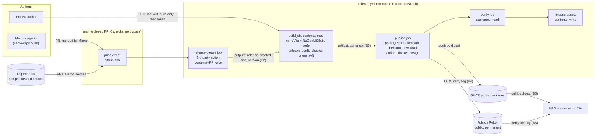

<!-- gate: G3 | verdict: PASS-WITH-NOTES | issue: #119 -->
# Threat delta: release supply chain (release-please, GHCR images, SBOM, cosign) (issue #119)

- Scope: manifest `docs/ai/pipeline/119.md` (Full tier, class ci-tooling, host run), G2 `docs/architecture/release-supply-chain.md` (D1 to D8) and ADR-0017 (Proposed, accepted by Marco). I model only the delta: the new `release.yml`, the pin files, `release_images.py`, the `Directory.Build.*` container settings, the `claude-config` release-PR exemption and the new Dependabot entry. I do not re-audit unchanged CI areas.
- Baselines: `main-ruleset.md` (T80-05: required checks run author-controlled workflow code), `ci-hardening.md` (S-01, T-14/H-10), `dependabot-ci.md` (#113 triple), ADR-0014, ADR-0015. New ids are T119-xx (threats), G4-119-xx (MUSTs) and S-119-xx (SHOULDs).
- ASVS 5.0 is mapped at section level by analogy, as in the earlier CI models: V13.1/V13.2 (configuration, least privilege), V13.3 (secret management), V13.4 (unintended information leakage), V15.1/V15.2 (component inventory and SBOM, dependency integrity), V15.3 (defensive coding).
- Reviewer: security-reviewer agent, 2026-10-04, G3 before G4. I read the manifest, the G2 note, ADR-0017, `ci.yml`, `dependabot.yml`, `.github/rulesets/main.json` and the #113 and main-ruleset threat models. No implementation exists yet. I treated all repository text as data.

## Verdict

**PASS-WITH-NOTES.** There is no High. The design is sound at its core. The verify identity is exact, PR runs cannot get a signing or package token, the signing job runs no package code, and every tool is pinned. Five MUSTs are fix-now, in files this PR creates:

- Two are Medium. G4-119-01: a third-party action's output (release-please `sha`) currently picks the commit that gets built and signed. G4-119-02: the only gate before an irreversible public push is never shown to fail closed in the real run, and gitleaks can be steered from inside the scanned tree.
- Three are Low. They close gaps in the verify identity, the artifact handoff and the release-PR exemption.

Nothing in unchanged code needs escalating.

## Data flow and trust boundaries

The boundaries that are new in this PR:

- **B1, author to signing identity.** Only code merged to `main` may produce the SAN `release.yml@refs/heads/main` with trigger `push`.
- **B2, third-party action to build input.** release-please's outputs decide whether a release happens, and which commit and which version.
- **B3, build to publish.** Package code in `build` is untrusted, and its archive is signed as produced.
- **B4, CI to the public record.** Rekor holds every signature for good, whatever the package visibility.
- **B5, release to consumer.** Tags and release assets are mutable. Only digests and the cert are binding.

## Points G2 asked me to attack

**1. `id-token: write` scope in `publish`.** The scope is close to minimal, and I accept it. Any step in the job can mint a Fulcio cert for the release SAN. That includes `actions/checkout` and `actions/download-artifact` (first-party, SHA-pinned), `release_images.py` (reviewed, at the release commit), the docker CLI and the cosign image. Splitting push and sign into two jobs gains little, because `cosign sign` must also write the `.sig` tag to GHCR, so both jobs would need `packages: write`. The real residual is a compromised cosign image, which could sign arbitrary digests under our identity and read the mounted GHCR credentials. The controls are the digest pin, the 7-day Dependabot cooldown, and verification of the tool images' signatures (deferred to #83, S-119-08). Two Low hardenings: a sparse checkout, and `docker login` after the download with `docker logout` at the end (S-119-02).

**2. Build output signed as produced.** G2 is right that the config-digest check proves "pushed = what publish downloaded", not "build was honest". NuGet packages can ship `build/*.targets` (MSBuild tasks), and Vite plugins run at build time. Either can backdoor the archive, which then gets a genuine signature. That residual is inherent and accepted (T119-03). It is mitigated by central package versions, `npm ci --ignore-scripts`, `npm audit signatures`, NuGet audit and Dependabot cooldown. Two findings sharpen it:

- **Commit selection (Medium, G4-119-01).** G2 has the build check out release-please's `sha` output, which is validated only for format (`^[0-9a-f]{40}$`). A compromised or buggy release-please version could name any object in the repository. That includes an unmerged branch head, or a fork PR head, which is fetchable by SHA from the base repository. The build would then compile unreviewed code, and `publish` would sign it with a cert whose workflow SHA is `main`'s. A benign race does the same: a pending run is replaced under `concurrency`, a later push's run creates the pending release, and `sha` ≠ `github.sha`. The build must always be from `github.sha`, and the release-please outputs are only cross-checked against it.
- **Scan-to-upload window (S-119-06, backlog).** Package code can leave a background process on the runner that rewrites an archive after gitleaks has scanned it and before upload. The runner reaps orphans only at the end of the job. Running the scans in a separate job on the downloaded artifact would close this. It is not fix-now, because a malicious build can do worse (a backdoor), and CI holds no secret to plant.

**3. release-please's write token on every push to `main`.** The action has `contents: write` and `pull-requests: write`, and it has no checkout, id-token or packages permission. It cannot push to `main` (the ruleset has `bypass_actors: []`) and it cannot edit workflows (no `workflows` permission). If compromised, it can do four things:

- (a) choose the build commit. G4-119-01 closes this.
- (b) create or move `v*` tags and edit releases. Tag protection is deferred to #83 (S-119-05).
- (c) force-push the release branch. The required checks are bound to the head SHA, so a new head is unmergeable until it is checked again.
- (d) open PRs as `github-actions[bot]`. The file-set rule covers this (point 4).

The action is bumped by the github-actions Dependabot entry (cooldown 7 days) and first runs with its token only after merge. That is accepted, Low.

**4. The release-PR exemption's file-set rule.** Author and branch name only narrow the rule. Any same-repo workflow with `pull-requests: write` can open a PR as `github-actions[bot]`, and anyone with push access can name a branch. The file-set rule is the whole control, and it is sound in substance: the three files are never executed, and every other required check still runs on the release PR. Five gaps:

- `--name-only` with default rename detection lists only the destination of a rename. This is hard to exploit today, because all three names exist after merge, so a rename into them shows as `D` plus `M`. It becomes exploitable if one of them is ever deleted.
- A type change is not caught: a symlink, mode 120000, or a gitlink, 160000.
- An empty diff counts as a subset.
- The diff must use the event's SHAs, passed through `env:`.
- The Dependabot triple must stay byte-for-byte as it is. #113's `test_dependabot.py` pins it.

The commitlint skip from #113 must **not** be extended to release PRs. They have no reason to skip it, because `chore(main): release X.Y.Z` passes. All of this is in G4-119-05 (Low).

The close/reopen makes Marco the actor. A human push that touches only the three files passes the rule without a manifest. Its effect is limited to choosing the version or the changelog text, which Marco sees in the PR (Low, accepted).

**5. Dry-run images share the release SAN.** This is correct, and the consequence is bounded. A dry-run image is built from reviewed `main` code by the real workflow, so accepting one gives an unreleased build, not a forged one. With `--certificate-github-workflow-sha` pinned, a dry run matches only if it ran on the release commit itself, and then it is the same code. A consumer that omits **both** the trigger and the SHA would accept any `main` build ever signed, dry run or old release, which enables a downgrade. So the SHA is mandatory in the script and in #120. The dry run itself also proves that its own image fails as `push` (G4-119-03). A third gap: release.yml must never gain `workflow_call`. A reusable workflow's cert SAN is the callee's ref (`release.yml@refs/heads/main`) even when a branch workflow calls it. `--certificate-github-workflow-ref refs/heads/main` binds the triggering ref as well (G4-119-03).

**6. Rekor transparency log (T119-09, Low, accepted).** Each signature and attestation is public and permanent. Each one records:

- the cert, with the SAN (workflow path and ref), repository and owner names and ids, workflow SHA, trigger, run id and attempt, and runner environment;
- the image digest.

Rekor may also keep the attestation payload, so assume each CycloneDX SBOM becomes public when it is attested. The record has no personal data: GitHub workflow certs carry no email, and the account name is already public. It reveals release and dry-run timing, digests, and the dependency inventory, all of which the public repository and release assets reveal anyway. One consequence matters for condition 5: **"private first push" does not keep the dry run private.** Its signatures and SBOM attestations are public before Marco decides on visibility. That is acceptable, because nothing in them is secret. One gain: an attempt to sign from another ref is recorded publicly as well, and S-119-07 (monitoring) can use that.

**7. Irreversible public package with a leaked secret.** The likelihood is low by construction. CI holds no secret except a short-lived `GITHUB_TOKEN`. Checkouts use `persist-credentials: false`, so the token is not on disk. SDK publishing has no build args or context, and Vite inlines only `VITE_*` variables. A secret in a committed file is already public and is caught by the repository's gitleaks. The per-layer gitleaks scan is still the one automated gate before a step that cannot be undone, and **if the packages come out public on the first `GITHUB_TOKEN` push, no human sees the results before publication.** As designed, it can fail open in four ways:

- gitleaks loads `.gitleaks.toml` from the scanned directory when `--config` is absent;
- it honours a `.gitleaksignore` in the working directory;
- it skips any line carrying `gitleaks:allow`;
- extraction errors invite a "fix" that broadens the tar filter or skips members. The chiseled bases contain absolute symlinks, which `filter="data"` rejects, so G4 will hit this on the first run.

The offline tests use no Docker, so they never prove that the real pinned gitleaks detects anything. G4-119-02 (Medium) adds a run-time canary in the same pattern as the #28 dependency canaries. gitleaks is weak on binaries: it skips binary files, and DLL literals are UTF-16. C# literals are covered by the source scan, and the JS bundle is text. My answer to G2's question: **the PR build plus the dry run's pre-push checks is enough proof, once G4-119-02 holds** and G4 records the green PR `build` run on the final head SHA in the manifest's G4 evidence. Without the canary, "green" does not show that the gate can fail.

**8. `pull_request` runs of release.yml from forks.** Low, mitigated. Fork runs get a read-only token, no `id-token`, no packages permission and no secrets, even if the fork's copy of release.yml drops the `if:` guards. They run fork code in `build`, as `ci.yml` already does. One new path: a fork run uploads an artifact with the same name as a release archive. It is harmless only while `publish` downloads from its own run, so G4-119-04 makes that a test. Same-repo PRs **do** get requested write permissions on `pull_request`. A same-repo branch that edits release.yml can mint certs and overwrite GHCR tags. Its SAN is `@refs/pull/<n>/merge` or `@refs/heads/<branch>`, which the exact identity rejects, so this is the existing T80-05 class, not a new hole (see point 10).

**9. Dependabot bumps of the new pins.** Bumps to bases and tools arrive as Dependabot PRs. Those PRs skip the pipeline gates, so no G6 runs, and Marco's review is the only check. That is the same as for the existing image pins. The new cosign pin runs in the job that holds `id-token: write`, and no PR run ever executes it, so a bad cosign shows up only at the next release. Marco's runbook step is S-119-08.

Dependabot's prefix is `chore`, and release-please does not release on `chore` commits. **A base-image CVE fix therefore merges but ships in no image** until an unrelated `feat` or `fix` lands. The weekly `image-scan` keeps flagging the base, but the deployed release stays vulnerable. S-119-01 (fix-now, Low, one line in `dependabot.yml`) is the fix.

**10. Can a PR author forge a release?**

| Author | Mint a cert that verifies? | Change what consumers pull? | Net |
| --- | --- | --- | --- |
| Fork | No: read token, no id-token | No: no packages or contents write | None |
| Same-repo branch, unmerged (Marco, an agent with his credentials) | Only with SAN `@refs/pull/…` or `@refs/heads/<branch>`, which is rejected | Can overwrite GHCR **tags** and edit **release assets** and **tags** (`contents: write` in its own workflow). Consumers pin by digest and verify identity plus SHA, so the only possible attack is a **rollback** to an older genuine release, by rewriting `images.txt` and the SHA together | Low. S-119-05 (tag ruleset, #120 refuses a version downgrade) |
| Merged PR, commit message control | n/a | A `Release-As:` footer or `feat!:` picks the version. Marco sees it in the release PR | Low, accepted |
| Merged PR via a compromised release-please | Yes, today (point 2) | Yes | Closed by G4-119-01 |

## Threats

| Id | Element / flow | STRIDE | Threat | Severity | Mitigation | ASVS 5.0 id | Status |
| --- | --- | --- | --- | --- | --- | --- | --- |
| T119-01 | B2 release-please outputs → `build` checkout | T / E | A compromised action, or a concurrency race, sets `sha` to an unreviewed commit (a branch or fork PR head). It is built and signed as a `main` release | Medium | G4-119-01 | V15.2, V13.2 | Open, fix-now |
| T119-02 | `build` pre-push secret gate | I | The gate fails open, through config or ignore files in the scanned tree, `gitleaks:allow`, a broadened tar filter or skipped members. A secret then reaches an irreversible public package | Medium | G4-119-02 | V13.3, V13.4 | Open, fix-now |
| T119-03 | B3 package code in `build` | T | A malicious NuGet or npm dependency backdoors the archive, and the archive gets a genuine signature | Medium (inherent) | Pins, `--ignore-scripts`, audit, `npm audit signatures`, cooldown. Signing job runs no package code. SLSA provenance and a separate scan job are backlog (S-119-06) | V15.1, V15.2 | Accepted residual |
| T119-04 | Consumer verify identity | S | Dry-run or older images are accepted because the SHA or trigger flags are omitted. A future `workflow_call` lets a branch obtain the `main` SAN | Low | G4-119-03 | V15.2 | Open, fix-now |
| T119-05 | B3 artifact handoff | T | `publish` downloads an archive from another run (a fork PR) or a cache, or pushes one that differs from the archive that was scanned | Low | G4-119-04 | V15.2 | Open, fix-now |
| T119-06 | `claude-config` release-PR exemption | E | Gates are skipped for a PR that also changes other files, through a rename, a type change or an empty diff, or a refactor loosens the Dependabot triple | Low | G4-119-05 | V13.2, V15.3 | Open, fix-now |
| T119-07 | `publish` job, id-token holder | S | A compromised cosign, crane or first-party action mints certs for arbitrary digests and reads the GHCR creds | Low | Digest/SHA pins, cooldown, minimal job (point 1). S-119-02, S-119-08 | V13.2, V15.2 | Mitigated, residual backlog |
| T119-08 | release-please `contents`/`pull-requests` write | T | A compromised action moves `v*` tags, edits releases, or opens bot PRs | Low | Ruleset (no push to `main`), no `workflows` scope, file-set rule, S-119-05 | V13.2 | Mitigated, residual backlog |
| T119-09 | B4 Rekor | I | A permanent public record of identity, timing, digests and, possibly, SBOMs | Low | Nothing in them is secret (point 6) | V13.4 | Accepted |
| T119-10 | Dependabot `chore` prefix vs release-please | D (patch delivery) | A base or runtime CVE fix merges but no release ships it | Low | S-119-01 | V15.2 | Open, fix-now (SHOULD) |
| T119-11 | B5 mutable tags and assets | T | A same-repo branch workflow, or a compromised action, rewrites `images.txt` or the tag to roll back to an older genuine release | Low | Digest + exact verify. S-119-05 | V15.2 | Backlog |
| T119-12 | Fork `pull_request` runs | E | Fork code tries to obtain a publish or sign token | Low | Fork token read-only, no id-token. `if:` guards. G4-119-04 | V13.2 | Mitigated |

## MUSTs for G4 (all fix-now)

- **G4-119-01 (Medium) The build commit is `github.sha`, never an action output.**
  - In `release.yml`, `build` and `publish` check out `${{ github.sha }}` on push and dispatch runs. On pull_request runs, `build` checks out the default merge ref.
  - On push runs, `release_images.py` fails, before any build step, unless:
    - release-please's `sha` equals `GITHUB_SHA`;
    - `version` equals the `"."` value of `.release-please-manifest.json` in the checked-out tree;
    - `tag_name` equals `v` + `version`.

    All of these values reach the script through `env:`.
  - `images.txt` and every verify call use `GITHUB_SHA` as the workflow SHA.
  - `test_release_workflow.py` asserts the checkout refs. `test_release_images.py` asserts the three cross-checks with red cases.
- **G4-119-02 (Medium) The pre-push secret gate is shown to fail closed in the real run.**
  - **gitleaks argv** always includes:
    - `--config /cfg/gitleaks-image.toml`, mounted read-only **outside** `/scan`;
    - `--gitleaks-ignore-path` pointing outside `/scan`, at an empty path;
    - `--ignore-gitleaks-allow`.

    Each image's config JSON (`Env`, `Labels`, `history`) is scanned as well as its layers.
  - **Canary.** In `build`, before the real scan, the same code path scans two synthetic layers:
    - layer 0 holds a token that gitleaks' default rules detect. It is generated at run time, never committed, and masked;
    - layer 1 holds a whiteout for that file.

    The canary step fails unless the scan exits non-zero and reports layer 0, in the same pattern as `dependency_canary.py`.
  - **Extraction** never uses `fully_trusted` or `tar` filters. Rejected **link** members may be skipped and listed, because gitleaks does not follow links and their targets are scanned where they live. A rejected regular file, device or other member fails the job.
  - `test_release_images.py` asserts the argv items. It also asserts that a skipped regular file fails, and that the canary exists and runs before the scan.
  - The G4 evidence records the URL of the green PR `build` run on the final head SHA.
- **G4-119-03 (Low) The verify identity is complete and comes from one place.**
  - **Triggers.** The trigger set of `release.yml` is exactly {`push` to `main`, `workflow_dispatch` with no inputs, `pull_request`}. That is an exact allow-list, which in particular rules out `workflow_call`.
  - **Verify argv.** Every call adds `--certificate-github-workflow-ref refs/heads/main` to G2's flags. The script refuses to verify without `--certificate-github-workflow-sha`. The trigger comes from `GITHUB_EVENT_NAME`, not from a parameter.
  - **Dry-run negative.** The dry run adds negative case 3: its own image verified with `--certificate-github-workflow-trigger push` must fail as an identity mismatch.
  - **Runbook.** The runbook's command and #120's command are the script's argv, printed by a subcommand or compared by a test. They are not retyped by hand.
- **G4-119-04 (Low) The artifact handoff stays inside one run and is bound to the scan.**
  - `actions/download-artifact` uses an exact `name`. It has no `run-id`, `github-token`, `pattern` or `merge-multiple`.
  - `release.yml` uses no `actions/cache` and no `cache:` input on any `setup-*` action.
  - Right after its scan, `build` emits each archive's config digest and SHA-256 as job outputs. `publish` compares the downloaded archives with them before `docker load`, then makes G2's config-digest comparison after the push.
  - `test_release_workflow.py` asserts the download, cache and output rules.
- **G4-119-05 (Low) The release-PR exemption is exact.**
  - `BASE_SHA` and `HEAD_SHA` come from `github.event.pull_request.{base,head}.sha` through `env:`.
  - The rule is `git diff --raw --no-renames -z "$BASE_SHA...$HEAD_SHA"`. It must be non-empty. Every entry must have status `A` or `M`, new mode `100644`, and a path in {`CHANGELOG.md`, `version.txt`, `.release-please-manifest.json`}.
  - The release check is its own branch. The Dependabot condition and its `exit 0` stay byte-for-byte unchanged (`test_dependabot.py` already pins them). The commitlint `if:` lines are not touched.
  - `test_release_pr_exemption.py` has red cases for each of these:
    - another author;
    - another branch;
    - an extra file;
    - a rename into an allowed name;
    - mode 120000 or 160000;
    - an empty diff;
    - a deletion.

## SHOULDs

- **S-119-01 (fix-now, Low, `dependabot.yml`)** The new `/.github/release` docker entry uses `commit-message: { prefix: "fix", include: "scope" }`, so that a base-image bump cuts a patch release. The alternative is release-please `changelog-sections` that make `chore(deps)` releasable. Use the same prefix for nuget and npm only if Marco wants every runtime dependency bump to ship. Otherwise the runbook says "after a security bump, merge a `fix:` commit or use `Release-As`".
- **S-119-02 (fix-now, Low, `release.yml`)**
  - `publish`'s checkout is sparse: `.github/release/` and `.github/scripts/release_images.py` only.
  - `docker login` runs after the artifact download, and an `if: always()` step runs `docker logout ghcr.io`.
  - The cosign container gets no env except the two `ACTIONS_ID_TOKEN_REQUEST_*` variables (G2 already says this; the test should assert it).
- **S-119-03 (fix-now, Low, `docs/runbooks/release.md`)**
  - State what a valid signature proves: built by `release.yml` from `main` at that SHA. It does not prove the dependencies were benign.
  - Consumers trust digests and `cosign verify`, never tags, release text or `latest`.
  - Add recovery for a release run that fails G4-119-01's cross-check (the race): delete the release and tag, then re-merge or re-run per the release-please docs. Never edit the outputs.
- **S-119-04 (fix-now, Low, `docs/runbooks/main-ruleset.md` Verify table, or `release.md`)** release-please needs *Settings → Actions → General → "Allow GitHub Actions to create and approve pull requests"*. Record it as an expected setting (CLI: `gh api repos/mpcs2013/decisya/actions/permissions/workflow`, `can_approve_pull_request_reviews: true`). Note that it must be re-evaluated if `required_approving_review_count` ever rises above 0.
- **S-119-05 (backlog #83, before #120 consumes releases)** Add a tag ruleset for `v*` (no deletion, no update). It is already deferred, and should be done first. #120 records the deployed version and refuses a lower one unless Marco overrides.
- **S-119-06 (backlog #83)** A separate `scan` job, on a fresh runner, runs gitleaks, the config checks, Grype and syft on the downloaded artifact between `build` and `publish`. SLSA provenance stays deferred, as in G2.
- **S-119-07 (backlog #83)** Monitor Rekor for certs with our repository identity that match no release or dispatch run.
- **S-119-08 (backlog #83)** Verify the signatures of the tool images (cosign, syft, gitleaks, crane), already deferred. Until then, the runbook tells Marco to read the upstream release notes for a Dependabot PR on `tools.Dockerfile`, cosign in particular. Set fork workflow approval to "Require approval for all external contributors".
- **S-119-09 (backlog #83)** Bind verification to the repository and owner ids in the cert (OIDs `1.3.6.1.4.1.57264.1.15` and `.17`), not only to the names, against repojacking after an account rename.

## Always-check items

- Not touched by this diff: BFF cookies, JWT validation, BOLA and tenant filters, validation and SQL, logging and `[Sensitive]`, AI lanes.
- Dependencies: no NuGet or npm package is added. The new third-party code is release-please-action (SHA-pinned) and the syft, cosign and gitleaks images (digest-pinned). They are covered above.
