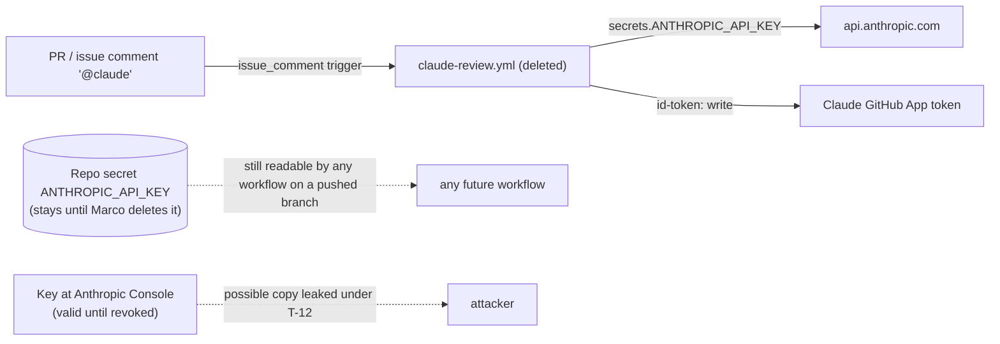

<!-- gate: G3 | verdict: PASS-WITH-NOTES | issue: #95 -->
# Threat delta: remove the on-demand claude-review workflow (issue #95)

- Scope: delete `.github/workflows/claude-review.yml`, update its three live references (`.claude/scripts/gates.py:54`, `.claude/tests/test_realm_guard_trigger.py:86`, `tests/Decisya.Identity.Tests/realm-guard-cases.json:93`), close the matching #28 items. Marco's out-of-PR steps: the `ANTHROPIC_API_KEY` secret and the Claude GitHub App.
- Baselines: `claude-config.md` T-12 (High, partly mitigated), `docs/security/reviews/35.md` T-12 and FU-3, `realm-guard-scope.md` T77-05. Historical models and reviews stay unchanged.
- Net effect: the removal **reduces** attack surface. T-12 closes for good only after the PR merges **and** the key is revoked (M4). Deleting the file alone does not close it.

## Data flow (before, and what is left after)

## Answers to the four questions

1. **Does removal weaken anything?** No, as long as M1 is done exactly as described. Today `DOCS_ONLY` in `gates.py` makes `classify()` call a change to `.github/workflows/claude-review.yml` *docs-only*, which means no G3/G6 by default. Once the alternative is deleted, any future file at that path or any other workflow falls through to `CI_TOOLING` (`^\.github/`), so it is classed ci-tooling with G3 and G6. Separately, `REVIEW_REQUIRED_PATHS` (`gates.py:316`, `\.github/workflows/[^/]+\.ya?ml`) already forces G3/G6 on every workflow file, this deletion included. On the realm-guard trigger: since #77, neither CI's `lanes` ignore (`ci.yml:54`) nor `prepush.CI_IGNORE` (`prepush.py:46`) has listed `claude-review.yml`, and `RealmGuard.cs` exempts only `ISSUE_TEMPLATE/` and `dependabot.yml`. So every `.github/workflows/**` change still counts as code on all three sides, with or without this file.
2. **Realm-guard cases:** keep a workflow row. It is the only `.github/workflows/**` row in the shared table, and dropping it would remove the T77-05 coverage of "workflow files are in the guard's scope and trigger .NET". See M2 for the path to use.
3. **Order of Marco's steps:** see M4. Every order fails closed, because a `@claude` comment on `main`'s workflow only errors out. The order matters for how long a still-valid key stays exposed.
4. **Required checks, rulesets, CI jobs:** none depend on the workflow. `.github/rulesets/main.json` requires `changes`, `build-test`, `codeql`, `claude-config` and `realm-guard`, all of them jobs in `ci.yml`. The workflow's job `review` is not a required context, so deleting it cannot leave an "Expected" check that blocks merges. No other workflow `needs` it or calls it.

## MUSTs (change the merge decision)

| Id | Element | STRIDE | Threat | Severity | Mitigation (MUST) | ASVS 5.0 id | Status |
| --- | --- | --- | --- | --- | --- | --- | --- |
| T95-01 | `gates.py` `DOCS_ONLY` | E, T | If the alternative is generalised (e.g. to `workflows/`) or left in, a workflow is classed docs-only and skips G3/G6 by default. A re-added `claude-review.yml` would also come back silently as docs. | Medium | **M1 (fix-now):** delete `\|workflows/claude-review\.yml$` outright, so the group reads `^\.github/(ISSUE_TEMPLATE/\|dependabot\.yml$)`. Add a `test_gates.py` case: `classify([".github/workflows/claude-review.yml"])` and `classify([".github/workflows/release.yml"])` both return `ci-tooling`, never `docs-only`. No test covers `classify()` today. | V13.1, V15.2 | Open (G4) |
| T95-02 | `realm-guard-cases.json:93`, `test_realm_guard_trigger.py:86` | T | If the row is dropped, nothing proves that workflow files stay in the guard's scope and trigger .NET (T77-05 regression). If `ci.yml` replaces it, the case also hits `ci.yml`'s special-case in the `spa_changed` regex and stops testing the generic rule. | Medium | **M2 (fix-now):** keep both rows, pointed at a workflow name that no regex special-cases, e.g. `.github/workflows/release.yml`, with the same content, `offends: true` and `in_scope: true`. Keep the `RealmGuardTests` in_scope assertion (G6-77-04), `test_every_in_scope_path_triggers_ci`, `test_every_in_scope_path_triggers_prepush` and parity green. | V15.2, V13.1 | Open (G4) |
| T95-03 | #28 follow-up list | R | Closing #28's claude-review item too broadly would also close T-16, SHA-pinning of the actions in `ci.yml`, which stays open. | Low | **M3 (fix-now, before merge):** the #28 comment closes only the claude-review items: T-12 remainder (b) to (d), FU-3's `claude-review.yml` part, and O-3 (`ANTHROPIC_API_KEY` in a GitHub Environment). Say so explicitly, and say that T-16 (SHA-pinning `actions/checkout`, `setup-*`, `codeql-action` in `ci.yml`) stays open. | V15.2 | Open (orchestrator) |
| T95-04 | Repo secret and Anthropic key | I, E | (a) Deleting the GitHub secret does not invalidate the key, and any copy leaked while T-12 was open stays usable. (b) Until the secret is deleted, any workflow on any pushed branch of this repo can read `secrets.ANTHROPIC_API_KEY`, including one pushed by a prompt-injected agent. | High (pre-existing T-12) | **M4 (Marco, out of PR, before merge or at merge):** in this order: (1) revoke the key in the Anthropic Console. This is the only step that ends (a). (2) Delete the `ANTHROPIC_API_KEY` repository secret, and check that no environment-level or org-level secret of the same name exists. (3) Remove the repository from the Claude GitHub App's access, or uninstall the app. Record the date of each step in the PR body. Steps (1) and (2) do not depend on the PR, and step (3) is last because nothing else uses the app. UI: *console.anthropic.com → API keys → Delete*; *GitHub → Settings → Secrets and variables → Actions* (Repository and Environments tabs); *GitHub → Settings → Integrations → GitHub Apps → Claude → Configure*. CLI: `gh secret list`, `gh secret list --env <name>`, `gh secret delete ANTHROPIC_API_KEY` (Marco's own login; agents don't run these). The sandbox key `DECISYA_SANDBOX_ANTHROPIC_API_KEY` is a separate key and is not affected. | V13.3, V13.2 | Open (Marco); T-12 closes when done |

## SHOULDs

- **S1 (fix-now, Low, file in this PR):** the comment above `DOCS_ONLY` (`gates.py:53`) says "Same 'not code' list as the changes job in ci.yml". That has been false since #77: `DOCS_ONLY` includes `^\.claude/` and `^\.vscode/`, which CI treats as code. Reword it so it describes change-class suggestion, not the CI lane, so nobody "re-syncs" it into CI's ignore list.
- **S2 (backlog #83, Low):** live docs still name the workflow. `docs/runbooks/main-ruleset.md:30` says "`ci.yml` and `claude-review.yml` both declare..."; `docs/architecture/agent-sandbox.md:23, 504, 709` mention O-3. These are one-line edits. Put them in this PR if Marco prefers, otherwise #83.

## Verdict

PASS-WITH-NOTES. No new trust boundary. The change removes a High-rated one (T-12), which fully closes when M4 is done. M1 to M3 are fix-now for G4 and the orchestrator. G6 checks M1 to M3 in the diff and the #28 comment, and checks that the PR body records M4.
