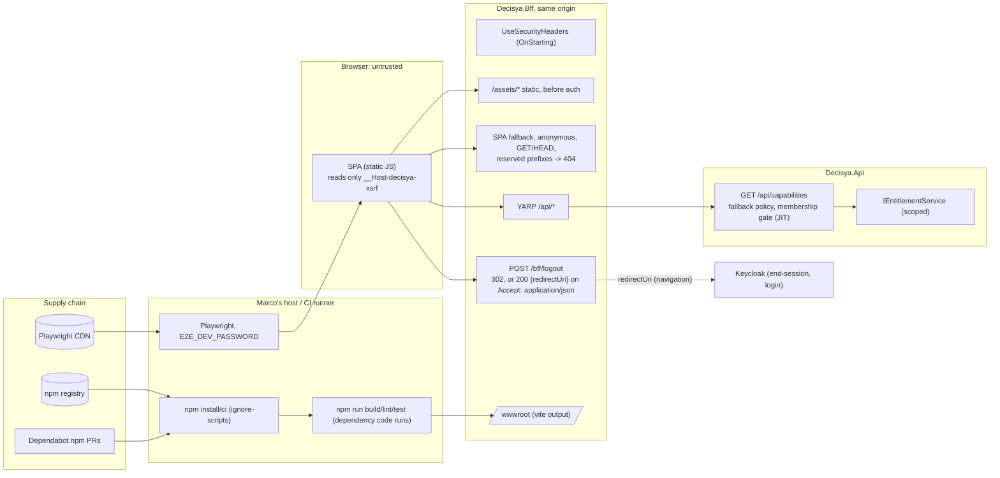

<!-- gate: G3 | verdict: PASS-WITH-NOTES | issue: #26 -->
# Threat delta: React SPA shell, capability manifest, logout JSON variant, first npm tree (issue #26)

- Scope: `docs/architecture/spa-shell.md` (G2, cited as **D1** to **D9**), `docs/requirements/phase-0/spa-shell.md` (G1), ADR-0008 amendment 1 (Accepted), the uncommitted `FeatureKeys.All` and `IEntitlementService` doc change, and the code G4 will change: `src/Decisya.Bff/Program.cs`, `Endpoints/BffEndpoints.cs`, `Session/OidcOptionsSetup.cs`, `Proxy/ProxyConfiguration.cs`, `.github/workflows/ci.yml`, `.github/dependabot.yml`, `.gitignore`.
- This is a delta. Parent models: `npm-install-guard.md` (**ni:**, C-1 to C-6), `host-development-default.md` (**hd:**, H-1), `bff-session.md` (#18), `bff-api-forwarding.md` (#19), `tenancy-module.md` (#21), `entitlements-module.md` (#23, C-3), `admin-api.md` (#25). Areas the diff does not touch are not re-audited.
- Mode: G3, before any code. Full tier. Runs on the **host** (manifest; ADR-0011). Marco runs every npm install.
- Reviewer: security-reviewer agent, 2026-10-03.

## Verdict

**PASS-WITH-NOTES.** The G2 design already carries most of the controls this delta would ask for: a strict CSP with no inline script, a fallback that only ever opens the constant `index.html`, a manifest that cannot be partial, a logout rewrite that re-checks the handler's own `Location`, and a credential-free Playwright config. All of ni: C-1 to C-6 are in the plan (table below), so nothing here causes a BLOCK. No High is open.

There are two Medium gaps, both in CI and Dependabot rather than in the application:
- the C# package rule does not run on the Web-only PRs it guards (M1);
- Dependabot npm PRs skip the 7-day cool-down and every gate (M2).

M1 to M4 are the MUSTs. Everything else is a SHOULD, marked fix-now or backlog.

## Carry-forward check (ni: C-1 to C-6, #23 C-3, #25 marker)

| Item | Where the plan meets it | Status |
| --- | --- | --- |
| C-1: #58 merged; `.npmrc` with `ignore-scripts=true` before the first install; scaffold pinned or not used | #58 merged as #101 (`c8fe2e0`). The hook is live: this G3 run was itself denied a `grep` that named npm, and the deny message carried the ni: S4 hint. The manifest records the user-level `ignore-scripts=true` (ni: S5). §5 step 2 creates `.npmrc` before step 4. D8 drops `npm create vite` completely, which is stronger than pinning it. | **Met by plan.** Marco verifies step 1 (`npm config get ignore-scripts` prints `true`). |
| C-2: the toolchain works with `ignore-scripts`; any `npm rebuild <pkg>` is named | §5 step 9; `npm rebuild` only after G6 review, named in the PR body. esbuild and Rollup/Rolldown ship native binaries as optional platform packages, so they need no script. | **Met by plan** (M3 records it) |
| C-3: `npm audit` and a lockfile read before the first `npm run` | §5 steps 6 and 7 (plus `npm audit signatures` and the `SOURCE`/`SCRIPT` check), before step 9 | **Met by plan** (M3) |
| C-4: the first agent Edit of `package.json` is the `**/package.json` ask probe | §5 order step 1; G4 evidence records whether it prompted | **Met by plan.** If it does not prompt, hd: open item 1 stays open (Low). Record it; it is not a merge blocker. |
| C-5: G6 reviews `scripts` and any `allowScripts` | §4: six scripts, no lifecycle script, no `allowScripts`, pinned by `SpaPackageTests`. None of the six installs, execs or fetches. | **Met by plan**, but the test does not run on Web-only PRs: **M1** |
| C-6: `typecheck`, `lint`, `test:e2e` scripts exist | §4 `package.json` | **Met by plan** |
| #23 C-3: an evaluation exception is never an allow | D1: no `try`/`catch`; the body is written only after the loop ends; generic 500; a G5 test makes the second key throw | **Met by plan** |
| #25 G2: the marker on `/api/admin` | D3: the marked set is exactly seven endpoints, pinned by `EntitlementMarkerTests` | **Met by plan** |

## Data flow

Trust boundaries:
- New: TB4 → TB5, the first npm tree, run on the host.
- Changed: TB1 → TB2, a public static surface plus new response headers.
- Unchanged: TB2 → TB3 (#19 forwarding), carrying one new endpoint.

## Threats

| Id | Element / flow | STRIDE | Threat | Severity | Mitigation | ASVS 5.0 id | Status |
| --- | --- | --- | --- | --- | --- | --- | --- |
| S-01 | First npm install (TB4 → TB5) | T, E | A dependency's lifecycle script runs as Marco during install | High if `.npmrc` were missing; Low as planned | ni: C-1: user-level and project `ignore-scripts=true` before the install; `--save-exact`; no `npm create` (D8) | V15.2, V13.1 | Mitigated by plan |
| S-02 | `npm run *` by Marco and by agents (TB5) | T, E, I | Dependency code (vite, rollup/rolldown, esbuild binary, eslint plugins, typescript, vitest, playwright) runs as Marco on the host with his secrets; a freshly compromised release is the realistic case | Medium (hd: H-1, accepted ADR-0011) | 7-day `--before` cool-down, `npm audit` and `npm audit signatures`, the lockfile `SOURCE`/`SCRIPT` read before the first `npm run` (C-3), the Q6 list and nothing more. Marco chose host over the recommended sandbox; the residual stays hd: H-1 Medium | V15.2 | Accepted (ADR-0011); M3 records the evidence |
| S-03 | CI SPA lane (TB4 → CI runner) | T, E | A Web-only PR that drops `ignore-scripts` from `.npmrc` or adds a lifecycle script runs it in `npm ci` on the runner. `build-test` checks out with persisted credentials. The `SpaPackageTests` guard lives in the .NET lane, and `dotnet_changed` excludes `^src/Decisya\.Web/`, so that guard is skipped on exactly those PRs | Medium | **M1** | V15.2, V13.1 | Open, MUST |
| S-04 | Existing ci.yml Playwright step | T, D | `npx playwright install --with-deps` (apt through sudo, then a download) and `npx playwright test`, with no AppHost and no password: a fetch-capable `npx` and a red job | Low (it breaks rather than leaks) | **M1**: remove the step (D7/§6) | V15.2 | Open, MUST |
| S-05 | Dependabot npm (`.github/dependabot.yml`, existing entry for `/src/Decisya.Web`) | T, E | It becomes live with the first `package.json`. Its PRs are exempt from G0 to G7 and the gates check, have no cool-down and no lockfile read, and Marco then runs the merged versions with `npm run` | Medium | **M2** | V15.2 | Open, MUST |
| S-06 | Playwright browser download | T | Browser builds come from the Playwright CDN over TLS, outside `npm audit signatures` | Low | Marco only; the version is pinned by the locked `@playwright/test`; recorded in the PR body. S-a removes the chance of an `npx` fetch | V15.2 | Accepted |
| W-01 | SPA fallback (D5) | S, I | The fallback swallows `/bff`, `/api` or the OIDC callbacks, which hides a server 404 and could serve HTML where JSON is expected | Low | `MapFallback` has the lowest route order, so every real endpoint wins. The OIDC handler intercepts `/signin-oidc` and `/signout-callback-oidc` in `UseAuthentication`. The reserved-prefix 404 (pinned set) and GET/HEAD only. A missing prefix serves only the static, identical document: no data and no `Set-Cookie`. `/health` and `/alive` exist only in Development and are reserved anyway | V4.1, V8.2 | Mitigated by design |
| W-02 | `/assets` before authentication | I | Path traversal or a hidden file read from outside the web root | Low | `PhysicalFileProvider` (root-bounded, `ExclusionFilters.Sensitive`, invalid path characters including `:` refused, which covers Windows alternate data streams), `ServeUnknownFileTypes=false`, no directory browsing, no path built from request data. The G5 traversal set | V5.3, V3.2 | Mitigated by design |
| W-03 | Bundle content | I | A secret is compiled into public JS: Vite inlines every `VITE_*` value from `.env*` files in `src/Decisya.Web` or from the build shell | Low | No `VITE_*` use is planned. `.env*` is git-ignored. Story 1's canary scan of every asset. S-d | V13.3, V14.3 | Mitigated; SHOULD S-d |
| W-04 | Caching | I | A shared or browser cache keeps `/bff/me` (email) or an `/api` body | Low | The default `no-store` (D6) closes the #18 `/bff/me` gap. The Api already sends `no-store`. `index.html` is `no-cache`. Only content-hashed `/assets` are `immutable` | V14.3 | Mitigated by design |
| H-01 | CSP and headers on every BFF response (D6) | T, I | XSS, clickjacking, MIME sniffing. The "set only when absent" rule lets a proxied upstream header replace the BFF's CSP, `X-Frame-Options` or `nosniff` | Low | The exact D6 policy is sound: no `unsafe-*`, `object-src 'none'`, `base-uri 'none'`, `frame-ancestors 'none'` plus `X-Frame-Options: DENY`. `OnStarting` survives `UseExceptionHandler`'s header clear. CSP does not govern top-level navigations, so `/bff/login` → Keycloak and `location.assign(redirectUri)` work. Keycloak's pages carry Keycloak's own CSP. No iframe, so `frame-src 'none'` costs nothing. S-b | V3.4 | Mitigated; SHOULD S-b |
| H-02 | `form-action 'self'` | D | A `<form>` "Sign in" would be blocked on its cross-origin redirect to Keycloak | Low (functional) | Story 2 requires a full-page navigation; G4 uses a link or `location.assign`, never a form | V3.4 | Note for G4 |
| L-01 | Logout JSON rewrite (D4) | S, I | Open redirect: a `redirectUri` that points off-site; the end-session URL becomes script-readable | Low | `Location` is built only by the OIDC handler from discovery metadata. `EnsureEndSessionLocation` pins status 302, an absolute URI, the scheme rule and the authority's scheme, host and port; on failure: a fixed-message 500 that does not echo the URL. No `id_token_hint` (#18 D3, tested). `state` is Data-Protection-protected and holds only `RedirectUri="/"`. The SPA accepts only `http:`/`https:`. No CORS, so no other origin can read the body | V3.7, V7.4 | Mitigated by design |
| L-02 | Logout CSRF | S | A cross-site request triggers logout | Low | G2's reasoning needs one correction: `Accept` is a CORS-safelisted header, so a cross-site `fetch` **can** send `Accept: application/json` with no preflight. The control is unchanged anyway: the `SameSite=Strict` session cookie is not sent cross-site, `X-XSRF-TOKEN` forces a preflight that fails, and the antiforgery filter checks the pair. Without CORS the response is unreadable | V3.5, V7.4 | Mitigated (#18 antiforgery) |
| L-03 | `RedirectUri` → `/` | T | Post-logout landing tampered with | Low | It is a constant inside the protected `state`. `post_logout_redirect_uri` is unchanged and realm-registered; no realm change | V3.7 | Mitigated by design |
| L-04 | Failed `Location` check after the local logout | D | 500 while the session is already gone; the SPA shows "sign-out failed" and still looks signed in | Low | The session and ticket are deleted, and B-2 has already ended the Keycloak session. S-e | V7.4 | Accepted; SHOULD S-e |
| C-01 | `/api/capabilities` evaluation error (D1) | E | A partial or allowing manifest on an exception | Low as designed (Medium as a class, #23 T-07) | No catch, sequential loop, body only after the loop, generic 500 (`status`, `title`, `traceId`), `no-store`. The SPA treats any non-200 or a malformed body as all-denied (NFR-41). The UI only hides; the server enforces | V8.2, V16.5 | Mitigated by design (G5 tests) |
| C-02 | Manifest information | I | Plan inference from the booleans | Low | Only the caller's own tenant's booleans: no plan, dates, reasons or ids. The tenant comes from the validated token only (`IEntitlementService` takes no tenant argument). A platform admin gets all-false with no query | V8.2, V14.2 | Accepted |
| C-03 | Membership gate on the manifest | T, D | The first manifest call JIT-provisions a tenant; a GET changes state; more calls hit the race | Low | As #21 T-06, T-07 and T-16: `tenant_id` is admin-edit only, JIT never claims an existing tenant, and the database decides the race (G4-21-03). The skip set stays `/api/whoami` plus the three admin routes. Only the frequency changes | V8.2, V2.3 | Mitigated (#21) |
| X-01 | Token exposure in the SPA | I | A token reaches script-readable storage, the DOM or a response | Low | BFF pattern unchanged; `/bff/me` and `{redirectUri}` carry no token. The rule "no `localStorage`/`sessionStorage`" is checked by Playwright. The only script-readable cookie is `__Host-decisya-xsrf`, which the SPA reads only after `/bff/me` and sends only as `X-XSRF-TOKEN` to the same origin. XSS would still allow session riding, as #18 states; CSP plus React escaping is the control | V3.3, V3.5, V7.2 | Mitigated by design; S-c |
| E-01 | `E2E_DEV_PASSWORD` | I | The dev-user password reaches `test-results/`, the console, the repository, or an agent's environment | Low (seeded dev users only) | Environment variable only, `trace`/`video` off, no HTML report, the teardown scan, never a step title. Marco sets it in a VS terminal that the Claude process does not inherit. **M4** pins the residual paths | V13.3, V16.2 | MUST M4 |
| E-02 | `ignoreHTTPSErrors` | S | TLS ignored against a non-local host | Low | The config throws unless the base URL's hostname is `localhost`, `127.0.0.1` or `[::1]` (WHATWG `hostname` keeps the brackets), exact match. Never `bypassCSP` | V12.3 | Mitigated by design; pinned by M4 |
| R-01 | `node_modules` skip in the repository scans | T | The skip hides a committed or planted file from `RealmGuardTests` and the other scans | Low | Exact repo-relative `src/Decisya.Web/node_modules/`, segment-aware (the G6-77-07 shape); `wwwroot` stays scanned; the guard against a vacuous scan stays; a positive case under `src/Decisya.Web/src/`. `node_modules/` is git-ignored, and CI's checkout has none | V15.2 | Mitigated by design |

## MUSTs for G4 (four)

- **M1, the CI SPA lane enforces the package rule on the PRs it guards (S-03, S-04).** devops, in `ci.yml`:
  - Remove the "Playwright (firefox + chromium, axe)" step completely (D7/§6). No `npx` stays in `ci.yml`.
  - Run `npm ci --ignore-scripts`. The explicit flag does not depend on the committed `.npmrc`, which the same PR could change. Then `npm audit --audit-level=high`, `npm audit signatures`, `typecheck`, `lint`, `test`, `build`.
  - A change to `src/Decisya.Web/package.json`, `package-lock.json` or `.npmrc` runs the package rule **before** `npm ci`. Do one of these:
    - (a) take those three paths out of the `dotnet_changed` exclusion, so `SpaPackageTests` runs. The .NET steps come first in `build-test`, so a failure stops `npm ci`;
    - (b) add a guard step before `npm ci` that reads only files: `grep -qxF 'ignore-scripts=true' .npmrc`, plus a check that `package.json` has no lifecycle script and no `allowScripts`. It needs no Node package.

    Record the choice in G4 evidence. Both choices also cover Dependabot npm PRs.
- **M2, Dependabot npm cool-down (S-05).** devops, in `.github/dependabot.yml`, on the existing `npm` entry: `cooldown: { default-days: 7 }`. It matches the first install's `--before`. Add one line to `GETTING-STARTED.md` (or the PR body, if no runbook covers Dependabot): before merging a Dependabot npm PR, run the §5 step 7 lockfile check on its lockfile. Any new `SOURCE` or `SCRIPT` line means do not merge.
- **M3, G4 evidence for the install (S-01, S-02, C-2 to C-4).** Marco's G4 evidence records:
  - the `--before` date;
  - `npm config get ignore-scripts` = `true`, and the committed `.npmrc` contents;
  - the `npm audit` and `npm audit signatures` summary lines: zero High or Critical, no invalid or missing signature;
  - the lockfile check output: no `SOURCE` line, and the `SCRIPT` list;
  - any `npm rebuild <pkg>`, by name (G6 reviews it; none expected);
  - the browser-install command used;
  - the C-4 probe result.

  G6 will BLOCK if the audit, signature or lockfile evidence is missing.
- **M4, E2E credential paths (E-01, E-02).** frontend-dev, in the files the PR adds:
  - `global-teardown.ts` scans `test-results/` for the password in raw, URL-encoded and JSON-escaped form. On a hit it **deletes** the offending files, then fails, naming the file path but never the value. A file left on disk can be read by any agent, and `test-results/` may hold `error-context.md` page snapshots.
  - The docs (§6 and `GETTING-STARTED.md`) set `E2E_DEV_PASSWORD` for the current shell only. They never use `setx`, a profile script, `launchSettings.json`, a `.env` file or a user/machine environment variable, because a persisted variable is inherited by every Claude session and agent Bash.
  - A static test (Vitest, or `SpaPackageTests` reading the file) pins `playwright.config.ts`: `trace: 'off'`, `video: 'off'`, no `html` reporter, and no `bypassCSP` anywhere under `src/Decisya.Web/` (excluding `node_modules`).

## SHOULDs

| Id | Item | Disposition |
| --- | --- | --- |
| S-a | §5 step 8 and the docs: `npx --no playwright install firefox chromium`. `--no` refuses a registry fetch if it runs outside `src/Decisya.Web` or before the install (ni: N-04) | **fix-now** (one token in the docs this PR changes) |
| S-b | `SecurityHeaders`: **always overwrite** `Content-Security-Policy`, `X-Frame-Options`, `X-Content-Type-Options`, `Referrer-Policy`, `Cross-Origin-*` and `Permissions-Policy`. Keep "set if absent" only for `Cache-Control`, the one header where a more specific value (assets, `index.html`, the Api's `no-store`) must win. A proxied upstream header then cannot weaken the BFF policy (H-01) | **fix-now** (a few lines in a new file) |
| S-c | Static source rule (Vitest or `SpaPackageTests`): no `dangerouslySetInnerHTML`, `innerHTML`, `eval(`, `new Function`, `localStorage` or `sessionStorage` in `src/Decisya.Web/src/**`. CSP already blocks the script cases; this catches them before the browser does (X-01) | **fix-now** (a few lines in a test the PR adds) |
| S-d | No `.env*` file under `src/Decisya.Web`, and no `VITE_*` reference in the source (W-03). A static fact in the same test | **fix-now** if S-c is done; otherwise backlog #83 |
| S-e | SPA logout: on a 500 (as on a 401), re-fetch `/bff/me` before showing the alert. The user then sees the true state, not "still signed in" (L-04) | **fix-now** (two lines in a new SPA file) |
| S-f | The SPA builds `/bff/login?returnUrl=` with `encodeURIComponent(pathname + search)`. The server's `ReturnUrlValidator` remains the control | **fix-now** (one call) |
| S-g | `build-test` checkout: `persist-credentials: false`. It is existing code, and the .NET build already runs PR code. M1 removes the new npm path | backlog #83 |
| S-h | Trusted Types and a CSP reporting endpoint (G2 deferral) | backlog #83 (already listed by G2) |

## Notes for G4 and G6

- `SpaPackageTests` must also assert that `.npmrc` keeps `ignore-scripts=true` (G2 lists it). With M1, that test is the CI guard.
- The JSON logout variant needs no new CSRF control (L-02). Correct the D4 sentence "A cross-site form cannot set `Accept`" in G4's code comment: the control is antiforgery plus `SameSite=Strict`, not the `Accept` header.
- "Sign in" is a link or `location.assign`, never a `<form>` (H-02).
- Known #83 items that this issue touches and that are not repeated here: ni: S1 (`Bash(npx playwright*)` in `settings.json`), S2, S3.
- No High or Medium flaw was found in unchanged code.
