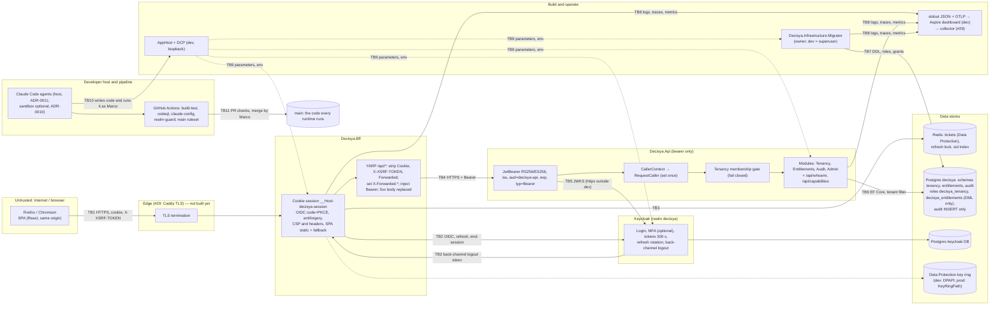

<!-- gate: G3 | verdict: PASS-WITH-NOTES | issue: #27 -->
# System baseline threat model: Decisya at the Phase 0 exit (issue #27, 0.15)

- Scope: Decisya as it stands on `main` at `a3e56dc` (after #26). The application (browser and SPA, BFF, Api with the Tenancy, Entitlements, Audit and Admin modules, Postgres, Redis, Keycloak, the migrator), the AppHost and dev tooling, and CI plus the agent pipeline.
- Mode: G3 for a docs-only issue. This file is the system-wide STRIDE model, the log, key and data inventories that ASVS V16.1, V11.1 and V14.1 ask for, and the High and Medium register. The ASVS 5.0 L2 control-by-control baseline is in `docs/security/asvs-l2-baseline.md`.
- Absorbs, by reference: every per-issue model in `docs/security/threat-models/` (table in "Absorbed models") and the G6 reviews in `docs/security/reviews/`. Ids from those files are cited as `<file>:<id>` (for example `bff-session:T-01`). Nothing is copied. Where they disagree with this file, this file wins for status, and the source file wins for the design detail.
- Carry-forwards covered: `apphost-servicedefaults.md` (#15) and `tenantid-result-types.md` (#32) in full; #32 F-6 in "tenant_id in logs"; #15 F-7 residual in "PII under an innocent name".
- Classification rule (Marco, 2026-10-03, `docs/ai/pipeline/27.md`): every High and Medium is (a) Closed with evidence, (b) Fix in #27, or (c) Linked to a later stage with issue, reason and trigger; Marco confirms each (c). Lows and Info go to #83.
- ASVS: 5.0.0, Level 2; V6 and V7 at Level 3. Ids at section level here; requirement level in the baseline file.
- Method: code reading at `a3e56dc`, `gh issue view` for #28, #29, #69, #83, the existing models and reviews, and two read-only scans: `dotnet list decisya.slnx package --vulnerable --include-transitive` (no vulnerable package in any of the 32 projects) and `npm audit --audit-level=high` in `src/Decisya.Web` (0 vulnerabilities), both 2026-10-03. No `.env`, user-secret or container environment was read.
- Reviewer: security-reviewer agent, 2026-10-03.

## Verdict

**PASS-WITH-NOTES.** Every High in the existing models has a mitigation in the code with a test, or a linked issue. No High is open without one. Three notes:

1. **One Medium needed code in #27: B-01, now Fixed.** #15 T-20 handed "the BFF starts a new trace root and drops browser `traceparent`, `tracestate` and `baggage`" to #19 (F-4), and #19's model and code never picked it up. Under Marco's rule it was (b). #27 fixed it in the BFF; the evidence is in the B-01 row.
2. **Some (c) links existed only in a threat model, not on the issue they name.** That included the production half (C-03) of the Highs `keycloak-realm:T-01` and `T-02` (production realm path, #17 F-1) and the Mediums C-02, C-05, C-06, C-07, C-11, C-13 and C-14. The orchestrator has now posted the link comments: L-1 and the C-20 addendum on #29, L-2 on #28, L-3 and L-4 in #83. With those in place, the Done-when ("every High mitigation has an issue or is closed") holds.
3. **Two new Mediums, linked as (c) to #29:** no anti-automation or rate limiting anywhere (C-09), and authentication events are not logged by Keycloak, the BFF or the Api (C-10). Neither can be exploited before a non-dev deployment. Marco confirmed both as #29 release blockers.

Every other High and Medium is (a) Closed, with code and test evidence. G6 reviews verified most of them, and I re-checked the key controls in the code (register section 3).

## System data flow and trust boundaries

There is no deployment yet: #29 builds the edge, the production realm and the Compose file.

| Boundary | What crosses it | Controls (where) | Source models |
| --- | --- | --- | --- |
| TB1 browser ↔ BFF | Cookies, SPA requests, `/bff/*`, `/api/*` | `__Host-` session cookie `HttpOnly; Secure; SameSite=Strict` (`CookieOptionsSetup.cs`); OIDC correlation and nonce `Lax`; antiforgery on every non-safe verb for `/bff` and `/api` (`AntiforgeryCheck.cs`, `ApiAntiforgeryMiddleware.cs`); strict CSP, nosniff, `no-referrer`, XFO, COOP, CORP, `no-store` default (`SecurityHeaders.cs`); HSTS outside Development; WebSocket and upgrade rejected on `/api`; no token reaches JavaScript (`TokenLeakScanTests`, SPA `static-rules.test.ts`) | bff-session, bff-api-forwarding, spa-shell |
| TB2 BFF ↔ Keycloak | Code + PKCE S256, client secret, refresh tokens, end-session, back-channel logout token | Confidential client; `query` response mode; https metadata outside Development, loopback-only relaxation (`OidcOptionsSetup.cs`); logout token: RS256/ES256, `iss`, `aud`, `events`, `sid`, no `nonce` (`LogoutTokenValidator.cs`); 16 KB body cap; refresh lock and conditional write-back | keycloak-realm, bff-session, bff-api-forwarding |
| TB3 BFF ↔ Redis | Encrypted tickets, lock values | Tickets protected per session key (`RedisTicketStore.cs`, purpose bound to the key); 256-bit CSPRNG keys; fail closed within 1.5 s; no local-cache fallback | bff-session |
| TB4 BFF ↔ Api | Bearer, request headers and bodies | Header strip and `Set` transforms, `Set-Cookie` removed, 5xx body replaced, https destination check (`ProxyConfiguration.cs`, `ReplaceUpstreamErrorBodyResponseTransform.cs`) | bff-api-forwarding |
| TB5 Api ↔ Keycloak JWKS | Signing keys | `RequireHttpsMetadata` outside Development; `ValidIssuer` pinned (`JwtBearerOptionsSetup.cs`) | api-jwt-validation |
| TB6 Api ↔ Postgres | Tenant data, admin writes, audit rows | One role per schema, DML only, history revoked; audit INSERT only; global tenant filter + write guard + IL rules; no raw SQL; Npgsql error detail and EF sensitive logging banned | tenant-query-filter, tenancy-module, entitlements-module, audit-module |
| TB7 Migrator ↔ Postgres | DDL, role passwords | SCRAM verifiers computed client-side; statement logging off; `WaitForCompletion` gate. Dev owner is the superuser (C-06) | tenancy-module, entitlements-module, audit-module |
| TB8 services → telemetry | Logs, traces, metrics | Two sinks only; masking core for both; scopes off on OTLP; HMAC `user_id`; query redaction on; no vendor SDK | apphost-servicedefaults, tenantid-result-types |
| TB9 AppHost and dev config | Generated parameters, user-secrets | Generated secrets, loopback binds, dashboard auth on, realm placeholder guard | apphost-servicedefaults, keycloak-realm |
| TB10 agents → host | Code that runs as Marco | Lanes and hooks are guardrails (ADR-0011); `git diff` review; sandbox for external content | claude-config, claude-hooks-hardening, agent-sandbox, agent-sandbox-docker-sidecar, host-development-default, agent-roster, roster-docs, npm-install-guard, pre-push-ci-parity |
| TB11 repository → CI → `main` | PR code, workflows, Dependabot | Main ruleset with required checks, PR-only merges by Marco, gitleaks, CodeQL, vulnerable-package and `npm audit` gates, realm guard, gate checker | main-ruleset, realm-guard-scope, remove-claude-review, claude-config |

## System-level STRIDE summary

Residual after the controls above. Each row points to the per-issue threats it summarises. The register has the status of every High and Medium.

| Id | Boundary | STRIDE | Threat (system view) | Residual | Key controls | ASVS 5.0 | Sources |
| --- | --- | --- | --- | --- | --- | --- | --- |
| SB-01 | TB1 | I, S | A token or session id reaches script, a URL or a log | Low | Ticket store, `/bff/me` DTO, `HttpOnly`, CSP, scans | V3.3, V7.2, V14.2 | bff-session:T-01, T-02, T-16 |
| SB-02 | TB1 | T, E | CSRF on a state-changing call (admin writes included) | Low | `SameSite=Strict` + antiforgery pair bound to the user, every non-safe verb | V3.5 | bff-session:T-04, bff-api-forwarding:T-06, admin-api:T-12 |
| SB-03 | TB1, TB2 | S | Session fixation, login CSRF, open redirect | Low | Fresh key on sign-in, PKCE + state, `IsLocalUrl` | V7.2, V10.2, V3.7 | bff-session:T-03, T-05, T-06 |
| SB-04 | TB2, TB5 | S, E | Forged token or logout token accepted | Low | Algorithm allow-list, `iss`, `aud`, `typ`, https metadata | V9.1, V9.2, V10.5 | api-jwt-validation:T-01 to T-05, bff-session:T-08, T-10, keycloak-realm:T-11 |
| SB-05 | TB4 | S, E | Client headers decide identity or tenant at the Api | Low | Identity from validated claims only; header strip | V4.1, V8.2 | bff-api-forwarding:T-01, T-19, api-jwt-validation:T-08 |
| SB-06 | TB4, TB6 | E, I | Cross-tenant read or write (BOLA) | Low | Filter, write guard, concurrency token, IL rules, membership gate, 404 on conflict | V8.2, V8.4 | tenant-query-filter:T-01 to T-14, tenancy-module:T-01 to T-12 |
| SB-07 | TB6 | E | Admin role escalation or an unaudited cross-tenant write | Low (dev); Medium once deployed (single factor, C-01) | `roles` exact parse, set-once caller, group policy, audit in the same transaction | V8.2, V8.3, V16.3, V6.3 | admin-api, entitlements-module, audit-module |
| SB-08 | TB6, TB7 | E, T | Over-privileged database principal | Low (Api); Medium for the dev superuser migrator (C-06) | DML-only roles, audit INSERT only | V13.2 | tenancy-module:T-12, T-13, audit-module:T-01 |
| SB-09 | TB8 | I | PII or secrets in logs, spans or exception text | Medium (F-7 residual, C-12) | Masking core, deny-list, shape masking, EF and Npgsql bans | V16.2, V14.2 | apphost-servicedefaults:T-07 to T-14, T-21 |
| SB-10 | TB1 → TB8 | T, R | Browser-chosen trace id and baggage continue through BFF to Api and Keycloak | Low (B-01 Fixed in #27) | The BFF starts a new trace root (`UseInboundTraceRoots`, `BffTracePropagator`) and YARP strips the browser's `traceparent`, `tracestate` and `baggage` | V16.4, V4.1 | apphost-servicedefaults:T-20 |
| SB-11 | TB1 | D | Unbounded request rates (credential stuffing at the BFF edge, costly endpoints, back-channel endpoint) | Medium once deployed (C-09) | Keycloak brute force; body caps; no rate limiter | V2.4, V15.2 | new |
| SB-12 | TB2, TB4 | R | Authentication successes and failures leave no record | Medium once deployed (C-10) | None (Keycloak events off; framework auth logs below the Warning floor) | V16.3 | new |
| SB-13 | TB9 | E, I | Dev realm or dev secrets used outside dev | Low (dev); High if #29 mounts the dev realm (C-03) | Realm guard, placeholder guard, two launch paths only | V13.1, V13.3 | keycloak-realm:T-01, T-02, realm-guard-scope |
| SB-14 | TB10 | E, T, I | Agent-written or package-supplied code runs as Marco | Medium (accepted, ADR-0011; C-17) | Lanes, hooks, `.npmrc` `ignore-scripts`, CPM, pre-push, review | V15.2, V8.2 | host-development-default:H-1 and gaps, npm-install-guard, pre-push-ci-parity |
| SB-15 | TB11 | T, E | A PR weakens its own gate or required check | Medium (C-15, C-16) | Ruleset with required checks, drift test, Marco merges | V15.2, V13.2 | claude-config:T-09, T-11, main-ruleset |
| SB-16 | TB11 | T | Supply chain: actions, images, packages | Medium (C-07, C-08) | Digest-pinned images, vulnerable-package and `npm audit` gates, Dependabot cool-down | V15.1, V15.2 | claude-config:T-16, keycloak-realm:T-09, spa-shell |

AI lane: no AI feature exists yet (no `IChatClient` registration in `src/`). Prompt injection, output validation, spend caps and the no-advice invariant are N/A until the first AI issue, whose G3 must model them.

## Absorbed models

| Model | Issue | Covers | State at baseline |
| --- | --- | --- | --- |
| `apphost-servicedefaults.md` | #15 | Logging pipeline, masking, hash key, OTLP, dashboard | Absorbed. All Highs closed; T-20 was B-01 (Fixed in #27); T-13 is C-12; T-02, T-15, T-22, T-23 are C-04 |
| `tenantid-result-types.md` | #32 | `TenantId`, `Result`, `DomainError` | Absorbed. Consumer sides closed by #20 to #25, except F-3 (C-13) and F-4 (C-14); F-6 below |
| `keycloak-realm.md` | #17 | Realm, clients, seeded users, images | Absorbed. F-1 is C-02 and C-03; F-2 is C-07 |
| `bff-session.md` | #18 | Cookie session, OIDC, ticket store, logout | Absorbed. T-09 production key ring is C-05 |
| `bff-api-forwarding.md` | #19 | YARP, refresh, server-side logout | Absorbed. All closed |
| `api-jwt-validation.md` | #20 | JwtBearer, fallback policy, errors | Absorbed. All closed; B-1 to B-5 are Low (#83) |
| `tenant-query-filter.md` | #22 | Filter, write guard, IL rules | Absorbed. All closed; RLS and trigger are Low (#83) |
| `tenancy-module.md` | #21 | Caller context, membership gate, roles | Absorbed. T-13 is C-06 |
| `entitlements-module.md` | #23 | Evaluation, admin commands, second role | Absorbed. All closed |
| `audit-module.md` | #24 | Append-only audit | Absorbed. All closed; retention and erasure in "tenant_id in logs" |
| `admin-api.md` | #25 | `/api/admin`, platform-admin | Absorbed. T-14 / C-5 is C-01 |
| `spa-shell.md` | #26 | SPA, headers, npm supply chain | Absorbed. All closed |
| `claude-config.md`, `claude-hooks-hardening.md`, `agent-roster.md`, `roster-docs.md`, `npm-install-guard.md`, `pre-push-ci-parity.md`, `host-development-default.md` | #35, #39, #74, #76, #58, #59, #56 | Agents, hooks, lanes, host development | Absorbed. Accepted residuals are C-17; T-09b and T-11 are C-15, C-16 |
| `agent-sandbox.md`, `agent-sandbox-docker-sidecar.md` | #36, #41 | Optional sandbox | Absorbed. Closed in #36 and #41; residuals are C-18, C-19 |
| `main-ruleset.md`, `realm-guard-scope.md`, `remove-claude-review.md` | #80, #77, #95 | CI integrity | Absorbed. All closed; #77 T77-09 remainder joins C-03 |

## Carry-forward: `tenant_id` in logs (#32 F-6)

Marco's decision stands: `tenant_id` is logged unmasked (G4-32-12 pins it), and it never authorizes anything (#15 T-19; checked: the only writer is `CallerContextMiddleware.cs:59-63`, from the validated claim, and nothing in `src/` reads the log context for a decision). The residual is Low, so it is not a register row. It still binds the components below.

1. **What it is.** For a single-person tenant (a household), `tenant_id` is a stable pseudonymous identifier of that person. So is the HMAC `user_id`, and so is the raw `sub` stored in `tenancy.memberships.user_id` and `audit.audit_records.actor_user_id`. All three count as personal data for retention and erasure (V14.2.4, V16.2.5).
2. **Retention.** Logs and traces carry no retention period today: the dashboard keeps them in memory, and container stdout follows Docker's defaults. Before a non-dev deployment, #29 sets one maximum retention for stdout and the collector, and enforces it in the collector and the container log driver. That is part of the existing #29 comment from #15 ("access control plus retention on the collector"). The value is Marco's decision.
3. **Erasure.** Log records are not rewritten. When a tenant or user is erased, erasure in logs means expiry at the retention limit. The privacy notice must say so. Rotating `UserIdHashKey` (#29) stops linking new records to old hashes, but it does not erase anything. The audit table keeps the raw actor id with no retention rule yet (#24 S-4, #83). The future erasure job must decide whether it pseudonymises `actor_user_id` or keeps it under a legal-obligation basis.
4. **Export to a tenant.** Any log export to a tenant (support, data-subject request) filters on the structured `tenant_id` field by exact match, never on message text. It excludes records whose `tenant_id` is null. Platform-admin records carry the target only as `target_tenant_id` inside `attributes` (`AdminLog.cs:12,18`), so the export reviews those records by hand before including them. It never includes another tenant's id. No export feature exists today. The issue that builds one carries these rules in its G3 (#83 line, L-4).

## Carry-forward: PII under an innocent name (#15 F-7 residual)

The masking core catches `[Sensitive]` members, deny-listed key fragments (`SensitiveDataMaskingProcessor.cs:64`), and JWT, bearer and URL shapes. It cannot catch a plain `string` that holds PII under an innocent placeholder name, for example `LogInformation("Paid {Payee}", tx.Description)`. It also renders every `string` member of a Decisya-declared type that lacks `[Sensitive]`.

- **Today:** no module logs user-entered free text. The one free-text field (the override reason) is `[Sensitive]` on both the request and the entity, and canary tests cover it (`EntitlementsReasonConfidentialityTests`). Every `LoggerMessage` template in `src/` takes fixed codes, ids or counts (G6 reviews 21 to 26). One instance of the class exists: `Membership.UserId` (`Membership.cs:40`) and `MemberDto.UserId` hold the raw `sub` and carry no `[Sensitive]`. Nothing logs them today. Low, #83 (L-4).
- **Control until the analyzer exists:** G6 reads every new log call site and every new Decisya type that holds personal data.
- **Residual:** Medium, C-12. The analyzer (#69, folded into #83) becomes a MUST in the G3 of the first issue that handles user-entered free text or contact data (Phase 1 transactions or payees, or tenant invitations by email). That G3 BLOCKs without it.

## Log inventory (ASVS V16.1.1)

| Producer | Sink | Fields | Personal data present | Never present |
| --- | --- | --- | --- | --- |
| `Decisya.Api`, `Decisya.Bff`, `Decisya.Infrastructure.Migrator` (ServiceDefaults) | stdout `decisya-json` (one JSON line per record) and OTLP logs; both through `SensitiveDataMaskingProcessor` | `timestamp`, `level`, `category`, `message` (template when anything was masked), `trace_id`, `span_id`, `tenant_id`, `user_id` (HMAC-SHA256, 128 bits, keyed), `attributes`, `exception` (masked seam) | `tenant_id`, `user_id` hash, `target_tenant_id` (admin events), trace ids | Tokens, cookies, session keys, passwords, raw `sub`, email, the override reason, Npgsql row detail |
| Same | OTLP traces | ASP.NET Core and HttpClient spans: route, `url.path` (may hold a tenant GUID on `/api/admin/tenants/{id}`), redacted query, status, `user_agent.original`; `Audit.Append` with `decisya.audit.action` | Tenant GUID in a path, user agent | Query values (redacted), bodies |
| Same | OTLP metrics | Bounded tags only: `result`, `operation`, `reason`, `action`, `outcome`, `rule` | None | Tenant or user tags (#15 T-30) |
| Keycloak | Container stdout (own format, unmasked) | Server log; **login and admin events are off** (`eventsEnabled` absent in the realm file) | Usernames and IPs on errors | — |
| Postgres | Container stdout | Server log; password statements run with statement logging off | Possible row values in constraint errors on the server side | Role passwords |
| Audit (`audit.audit_records`) | Database table, append-only | Tenant, instant, actor (`[Sensitive]`), action, outcome, feature key, trace id | Raw actor id | Free text |
| Agent hooks | `.agent-logs/hooks.jsonl` (git-ignored, size-capped) | Decision, agent, rule, repository-relative path | None by schema | Command text |

Documented destinations (V16.2.3): stdout to DCP or the container runtime, and OTLP to the Aspire dashboard (dev, loopback, API key). Production adds one collector (#29). Nothing else may receive logs. `docs/observability/signal-catalogue.md` still lists a `Bff.Login` span with a `decisya.tenant_id` attribute, a `Tenancy.CreateTenant` span and a `decisya.bff.auth.failures` counter. None of them exists in `src/`, and the attribute would contradict #15 T-30. That is a Low doc fix (#83, L-4).

## Key and secret inventory (ASVS V11.1.1, V11.1.2, V13.3)

| Material | Algorithm or form | Where it lives (dev) | Production owner |
| --- | --- | --- | --- |
| Keycloak realm signing key | RS256 (realm default, pinned by `RealmConfigurationTests`) | Keycloak DB | C-20 (#29): key rotation through Keycloak key providers |
| `decisya-bff` client secret | Shared secret, Aspire-generated, 32+ chars | AppHost parameter (user-secrets) | C-20 (#29): secret store and rotation |
| Data Protection key ring (BFF) | Framework default (AES-256-CBC + HMAC-SHA256), ticket purpose bound to the session key | `%LOCALAPPDATA%` with DPAPI | C-05 |
| Session key, antiforgery tokens | 256-bit CSPRNG (`RedisTicketStore.cs:34,267`); framework antiforgery | Cookie and Redis | — |
| `UserIdHashKey` | HMAC-SHA256, 32 bytes; ephemeral CSPRNG key in Development only | Process memory | C-04 (#29, posted) |
| Database role passwords (tenancy, entitlements, keycloak) | Aspire-generated, `^[A-Za-z0-9]{32,}$`, SCRAM-SHA-256 verifier computed client-side (`ScramSha256Verifier.cs`) | AppHost parameters | C-20 (#29): secret store and rotation; C-06 for the owner role |
| Postgres superuser, Keycloak admin, Redis passwords | Aspire-generated | AppHost parameters | C-20 (#29): secret store and rotation |
| Dev user password | Parameter, checked by `RealmSecretRules` | user-secrets | Never in production (C-03) |
| TLS | ASP.NET Core dev certificate | Host store | #29 (Caddy) |

## Data classification (ASVS V14.1.1, V14.1.2)

| Class | Data today | Where | Required protection |
| --- | --- | --- | --- |
| Secret | Passwords, tokens, client secret, session key, keys above | Keycloak, Redis (encrypted ticket), parameters | Never logged, never in browser JS, never in source; encrypted at rest where stored |
| Personal (direct) | Email, name, username | Keycloak; `/bff/me` returns the user's own email | Shown only to its owner; not logged |
| Personal (pseudonymous) | `sub`, `tenant_id`, `user_id` hash, `actor_user_id` | Tenancy and audit tables, logs | Retention and erasure as in "tenant_id in logs"; `[Sensitive]` on stored fields that hold `sub` (L-4 item) |
| Personal (free text) | Override reason | `entitlements.feature_overrides` | `[Sensitive]`, never logged, never in exception text |
| Business configuration | Plans, features, trials, overrides | Entitlements | Tenant filter |
| Financial | None yet (Phase 1) | — | The Phase 1 G3 adds it here |

## High and Medium register

Columns: Id, source, severity, finding, status, evidence, class. "Verified" means I re-read the control in the code at `a3e56dc`. Otherwise the evidence is the G6 review named.

### 1. (b) Fix in #27

| Id | Source | Sev | Finding | Fix | Owner lane | Status |
| --- | --- | --- | --- | --- | --- | --- |
| B-01 | apphost-servicedefaults:T-20, F-4 (handed to #19, dropped there; not in `bff-api-forwarding.md`) | Medium | The BFF adopts a browser `traceparent` and extracts `baggage`. ASP.NET Core hosting extracts both with the default `DistributedContextPropagator`, and OTel's ASP.NET Core instrumentation sets `Baggage.Current` from the default text-map propagator. YARP and `KeycloakTokenClient` then inject that context into the Api and Keycloak calls. This is the framework behaviour #15 recorded under "Evidence" (the default propagator carries W3C `baggage` as well as `traceparent`). Effects: clients choose trace ids, so log correlation can be forged or polluted, and client baggage travels to every downstream call, including future AI and aggregator vendors. As found at `a3e56dc`, nothing in `src/Decisya.Bff` handled `traceparent` or `baggage`, and `ProxyConfiguration.cs` stripped only `Cookie`, `X-XSRF-TOKEN` and `Forwarded`. | In `Decisya.Bff` only: register a `DistributedContextPropagator` that extracts nothing on the inbound side, so every BFF request starts a new root, and stop the OTel ASP.NET Core instrumentation from extracting baggage in the BFF (for example a trace-context-only default propagator in the BFF host, or a no-op extract). Outbound injection of the BFF's own context stays. Tests (`Decisya.Bff.Tests`): a request with a canary `traceparent` and `baggage` gives a server span with a different trace id, and the Api double and the Keycloak stub receive no canary baggage and a `traceparent` with the BFF's trace id. The Api keeps honouring the BFF's `traceparent` (it is inside the boundary). | identity-dev (`src/Decisya.Bff/**`); platform-dev only if the change goes into ServiceDefaults | **Fixed in #27.** `src/Decisya.Bff/Proxy/BffTracePropagator.cs`; YARP strips `traceparent`, `tracestate` and `baggage` (`ProxyConfiguration.cs`); `UseInboundTraceRoots` in ServiceDefaults (`Extensions.cs`), called by the BFF `Program.cs`; tests `tests/Decisya.Bff.Tests/TraceContextIsolationTests.cs` and `tests/Decisya.ServiceDefaults.Tests/Telemetry/InboundTraceRootsTests.cs` |

Link actions (orchestrator; no code, no new issue). All four are posted: L-1 and the C-20 addendum on #29, L-2 on #28, L-3 and L-4 in #83.
- **L-1 (#29):** post #17 F-1 (production realm: no seeded users, `sslRequired: all`, `KC_HOSTNAME`, admin console not published or on a separate host, Compose `${VAR:?}` fail-closed placeholders, realm migration strategy, login and admin events on with retention, a check that no `dev-` user or `.test` email exists), F-77-2 (mount one realm file, never the directory), MFA and common/breached-password policy for every user, the Data Protection key ring (C-05), the migrator/owner role and production credentials (C-06), internal transport (C-11), and C-09 and C-10 (Marco-confirmed release blockers).
- **L-2 (#28):** post #17 F-2: scan the pinned Keycloak, Postgres and Redis images and fail on High or Critical, also on Dependabot digest bumps.
- **L-3 (#83):** add #32 F-3 (Wolverine uses System.Text.Json; an envelope without a tenant fails), #32 F-4 (one tenant key builder that reads `TenantId.Value`), and note under "#22 G3, for the messaging issue" that the same issue carries #23 S-4 and #24 C-4's Wolverine bullet.
- **L-4 (#83):** the new Lows from this baseline (list at the end).

### 2. (c) Linked to a later stage (Marco confirms each)

| Id | Source | Sev | Finding | Issue | Reason | Trigger |
| --- | --- | --- | --- | --- | --- | --- |
| C-01 | admin-api:T-14 / C-5; keycloak-realm:T-16 (admin part, F-6) | Medium (deployed) | `platform-admin` is single-factor, and `/api/admin` does not require MFA `acr`/`amr` | #29 (posted) | Synthetic dev accounts only; MFA policy belongs with the production realm | Before any non-dev deployment |
| C-02 | keycloak-realm:T-16; ASVS V6.3.3, V6.2.4, V6.2.11, V6.2.12 | Medium | No MFA enforcement for tenant users; no common, context or breached password check (`passwordPolicy` has length, `notUsername`, `notEmail` and history only) | #29 (L-1 posted) | No real user exists; the policy lives in the production realm | Before the first non-synthetic user account |
| C-03 | keycloak-realm:T-01, T-02 (High, production half), T-18, T-20; realm-guard-scope:T77-09 remainder | High (prod half) / Medium | A production deployment could launch with the dev realm, fail-open placeholders, `sslRequired: external` or a published admin console | #29 (L-1 posted) | Only the AppHost and Testcontainers launch the realm today, and both are guarded (`RealmSecretRules`, `PlaceholderSubstitutionRegressionTests`, `RealmGuardTests`) | Before #29 adds any Compose or deployment launch path |
| C-04 | apphost-servicedefaults:T-02, T-15, T-22, T-23 (#15 F-3) | Medium | Environment not pinned; hash key provisioning and rotation; production probes and sampling; OTLP over TLS with auth, collector access control and retention | #29 (posted) | Deployment configuration | Before any non-dev deployment |
| C-05 | bff-session:T-09 ("prod storage → 0.16/0.17") | Medium | Outside Development the key ring path is required (`BffOptionsEnvironmentValidator.cs`), but nothing says where it lives, who can read it, whether it is encrypted at rest (no `ProtectKeysWith*`) or backed up | #29 (L-1 posted); backup with #30 | Only the deployment decides the volume, permissions and key protection | Before any non-dev deployment |
| C-06 | tenancy-module:T-13, S-5 | Medium | The migrator connects as the Postgres superuser and owns the schemas; PUBLIC keeps `CONNECT` on `postgres` | #29 (L-1 posted; #83 tags it 0.16; production credentials sit in #29) | Dev volume only; the Api already runs least-privilege | Before any non-dev deployment |
| C-07 | keycloak-realm:T-09 (F-2) | Medium | Pinned container images are never scanned for CVEs | #28 (L-2 posted) | CI hardening scope | #28 |
| C-08 | claude-config:T-16 (#35 review) | Medium | Actions and pre-commit repositories pinned by mutable tag | #28 (posted on #95) | CI hardening scope | #28 |
| C-09 | **New** (ASVS V2.4.1, V15.2.2) | Medium (deployed) | No anti-automation anywhere: no `AddRateLimiter` in the BFF or the Api, no per-session or per-IP limit on `/bff/login`, `/bff/backchannel-logout` (RSA verify per request), `/api/*` or `/api/admin` (#25 G2 deferred it to #83). Keycloak brute-force protection covers password guessing only. | #29 (L-1 posted; Marco-confirmed release blocker) | No exposure before a deployment; the limits depend on the edge (Caddy) and the topology | Before any non-dev deployment. Fix: ASP.NET Core rate limiter in the BFF (partition by session, else by client IP from the edge), with a 429 ProblemDetails, plus an edge limit; tests per route class |
| C-10 | **New** (ASVS V16.3.1); keycloak-realm F-1 (events) | Medium (deployed) | Authentication is not logged anywhere. Keycloak login and admin events are off. The BFF logs no sign-in success or failure. The Api's JwtBearer failures log at Information under `Microsoft.AspNetCore`, which `appsettings.json` floors at Warning, so token forging attempts leave no record. | #29 (L-1 posted; Marco-confirmed release blocker) | Nothing to detect before a deployment | Before any non-dev deployment. Fix: Keycloak events on, with retention; a fixed-text `BffLog` event for sign-in success and failure and for sign-out; an Api `Warning` event for a rejected bearer with a reason code and no token data |
| C-11 | ASVS V12.3.1, V13.2.1; bff-session (Redis) | Medium (deployed) | Internal hops (BFF to Redis, Api and migrator to Postgres, Keycloak to its DB) are plaintext. Redis and Postgres exposure and authentication in production are unspecified. | #29 (L-1 posted) | One-host dev topology on loopback | Before any non-dev deployment |
| C-12 | apphost-servicedefaults:T-13 (F-7 residual) | Medium | PII under an innocent placeholder name escapes masking | #69, folded into #83 | No module logs user-entered free text today; G6 reads every log call site | The first issue that handles user-entered free text or contact data. Its G3 makes the analyzer a MUST |
| C-13 | tenantid-result-types:T-12 (F-3); tenant-query-filter F-2; entitlements-module S-4 | Medium | With Wolverine, a non-STJ serializer could build a default `TenantId`; discovery could reach the internal admin handlers; outbox entities need their own context | #83 (L-3 posted; no messaging issue exists) | Wolverine is not referenced yet (ADR-0005) | The issue that adds Wolverine. Its G3 carries all three |
| C-14 | tenantid-result-types:T-02, T-04 (F-4) | Medium (High once keys exist) | A Redis or object-storage key built from raw claim text or a default `TenantId` | #83 (L-3 posted) | No tenant-keyed key exists (the ticket store keys by session) | The first Redis or storage key that contains a tenant |
| C-15 | claude-config:T-11 (#37) | Medium | `claude-config` runs the PR's own `lint.py` and `gates.py` | #83 (#37) | Tooling freeze (#84); the ruleset, required checks and Marco's merge bound it | Phase 0 exit review |
| C-16 | claude-config:T-09(b) (#38) | Medium | Skip approvals in the manifest are free text, not bound to Marco's identity | #83 (#38) | Tooling freeze; Marco merges every PR | Phase 0 exit review |
| C-17 | host-development-default:H-1, (c), (d), (e), sb:T-12; claude-config:T-01, T-02, T-04 residual, T-10; npm-install-guard:N-06, N-08; spa-shell:S-02; pre-push-ci-parity:P-05; agent-sandbox:T-11, T-20 | Medium (accepted) | Agent-written and dependency code runs as Marco on the host; hooks and lanes are guardrails | ADR-0011; #60 and #61 in #83 | Marco's recorded decision (ADR-0011) | The ADR-0011 sandbox triggers (new third-party package, external content); revisit before any non-synthetic secret or data is on the dev host |
| C-18 | agent-sandbox-docker-sidecar:T-41-01 residual, T-41-05 (G4-41-06 partial), T-41-01 (G4-41-10 partial); review 41 N41-05 to N41-09; agent-sandbox O-1 | Medium | Sandbox engine residuals | #48, #52, #42, #43, #44 (all in #83) | The sandbox is optional since ADR-0011 | Before the next `--with-docker` sandbox run |
| C-19 | review 41 N41-12 (remainder) | Medium (process) | Host-leak canary used Marco's real user-secrets store; Marco's own check of the store is not recorded | #49 (in #83) | Process fix | Before the next host-leak canary run; Marco records his check |
| C-20 | #27 G6-27-01; ASVS V13.3.1, V11.1.1 | Medium (deployed) | No production secret store and no rotation procedure for the `decisya-bff` client secret, the realm signing key, and the Postgres, Keycloak-admin and Redis passwords (dev: AppHost parameters) | #29 (L-1 addendum posted; Marco confirmed 2026-10-03) | Dev holds only generated, dev-only values; the store and rotation depend on the deployment | Before any non-dev deployment |

### 3. (a) Closed

Grouped by source. Every id listed is a High or Medium in that file.

| Id | Source and ids | Status | Evidence |
| --- | --- | --- | --- |
| A-01 | bff-session: T-01, T-08, T-10 (High); T-02 to T-07, T-12, T-16 (Medium) | Closed | Verified: `CookieOptionsSetup.cs` (cookie flags, 10 h absolute), `OidcOptionsSetup.cs:32-61` (code + PKCE, query mode, tokens in the ticket, front-channel sign-out off), `LogoutTokenValidator.cs:44-51`, `SessionFixationGuard` before `UseAuthentication` (`Program.cs`), `RedisTicketStore.cs` (per-key protector, 1.5 s). Tests: `TokenLeakScanTests`, `SessionFixationTests`, `BackchannelLogoutTests`, `ReturnUrlTests`, `RedisFailureTests`, `TicketProtectionTests`, `AntiforgeryTests`. T-12 closed by #19 B-2 (`KeycloakTokenClient` end-session). G6 #18 PASS |
| A-02 | bff-api-forwarding: T-01, T-05, T-06 (High); T-02, T-04, T-07, T-08, T-09, T-15, T-19 (Medium) | Closed | Verified: `ProxyConfiguration.cs:55-71`, `ReplaceUpstreamErrorBodyResponseTransform.cs`, `ApiAntiforgeryMiddleware.cs`, `UpgradeRejectionMiddleware.cs`, `BffOptionsEnvironmentValidator.cs` (https Api address). Tests: `ApiForwardingTests`, `ApiAntiforgeryTests`, `TokenRefreshTests`, `LogoutTests`. T-19 closed by #20 T-08. G6 #19 PASS |
| A-03 | api-jwt-validation: T-01, T-02, T-07, T-08, T-09 (High); T-04, T-05, T-06, T-11 (Medium) | Closed | Verified: `JwtBearerOptionsSetup.cs` (RS256/ES256, pinned `ValidIssuer`, `aud`, 60 s skew, `typ=Bearer`, `IncludeErrorDetails=false`, `SaveToken=false`); `Program.cs` (`UseExceptionHandler` first, every environment). Tests: `TokenValidationTests`, `JwtBearerOptionsPinnedTests`, `FallbackPolicyTests`, `ChallengeResponseTests`, `ExceptionHandlingTests`, `CallerIdentityTests`. G6 #20 PASS |
| A-04 | tenant-query-filter: T-01 to T-05, T-07, T-10, T-14 (High); T-06, T-08, T-12 (Medium) | Closed | `TenantDbContext.cs`; tests `TenantQueryFilterTests`, `TenantWriteGuardTests`, `TenantDbContextGuardTests`, `CrossTenantReadBackTests`, rules `CrossTenantQueryRule`, `BulkTenantMoveRule`, `TenantModelRule`; review 22 G6-22-01 fixed (`986c91f`). T-08 residual (selector built elsewhere) is Low, #83 F-1. T-12 and T-14 closed by #21 (`ArchitectureScope`, scoped set-once `RequestCaller`, `ValidateScopes` in `Program.cs`) |
| A-05 | tenancy-module: T-01, T-02, T-03, T-05, T-06, T-10, T-12 (High); T-04, T-07, T-09, T-14 (Medium) | Closed | Verified: `CallerContextMiddleware.cs` (403 before routing, set once), `Program.cs` order, `MigrationRunner.cs:151-158` (DML-only grants, history revoked). Tests: `TenantMembershipGateTests`, `TenantMembershipGateRaceTests`, `TenancyIsolationTests`, `TenantClaimForbiddenTests`, `ConcurrencyConflictHttpRoundTripTests`, `MigrationRunnerIntegrationTests`, `NoSensitiveEfSwitchesTests`. G6 #21 PASS. T-13 is C-06 |
| A-06 | entitlements-module: T-01, T-02, T-03, T-06, T-10, T-12 (High); T-05, T-07, T-08, T-09, T-11, T-13 (Medium) | Closed | Tests: `EntitlementsIsolationTests`, `EntitlementsFailClosedTests`, `EntitlementsRoleIntegrationTests`, `EntitlementsReasonConfidentialityTests`, `GrantOverrideRaceRecoveryTests`, `EntitlementsTrialTests`, `EntitlementsAdminPreconditionTests`. T-05 (unaudited window) closed by #24 (C-1). G6 #23 PASS |
| A-07 | audit-module: T-01, T-04 (High if wrong); T-02, T-05, T-06, T-07, T-11 (Medium) | Closed | `MigrationRunner.cs` append-only grant step; tests `AuditGrantsIntegrationTests`, `EntitlementsAuditAtomicityTests`, `EntitlementsAuditActorTests`, `AuditRuleTests`, `RawAdoNetRule` allow-list (review 24 G6-24-01 fixed). G6 #24 PASS |
| A-08 | admin-api: T-01 to T-04, T-12 (High); T-05, T-07 to T-11 (Medium) | Closed | Review 25, all five MUSTs PASS; tests `CallerIdentityRolesTests`, `EndpointAuthorizationTests`, `AdminAuthorizationTests`, `AdminRequestBodyTests`, `AdminApiAntiforgeryTests`, `AdminReachabilityTests`. T-14 is C-01 |
| A-09 | spa-shell: S-01 (High if wrong); S-03, S-05 (Medium) | Closed | Review 26 M1 to M4 met: CI guard before `npm ci --ignore-scripts`, Dependabot 7-day cool-down, `SpaPackageTests`, `static-rules.test.ts`, `global-teardown.ts`. `npm audit` 0 today. S-02 is C-17 |
| A-10 | keycloak-realm: T-03, T-11, T-12, T-14 (High); T-01, T-02 dev half (High); T-05, T-07, T-13, T-15 (Medium) | Closed | Realm settings re-read today (RS256, 300 s tokens, refresh rotation with max reuse 0, registration off, brute force on, `admin-cli` without direct grants). Tests: `RealmConfigurationTests`, `RealmExportFileTests`, `TenantSelfEditTests`, `PlaceholderSubstitutionRegressionTests`, `RealmSecretRulesTests`, `KeycloakDbInitScriptTests`. Review 17 G6-01, G6-02 fixed. Production halves: C-01 to C-03, C-07 |
| A-11 | apphost-servicedefaults: T-07 to T-10 (High); T-04, T-05, T-06, T-11, T-12, T-14, T-18, T-21 (Medium) | Closed | `SensitiveDataMaskingProcessor.cs`, `DecisyaJsonConsoleFormatter.cs`, `MaskingLogRecordProcessor.cs`; tests `SensitiveDataMaskingProcessorTests`, `DecisyaJsonConsoleFormatterTests`, `LoggingProvidersTests`, `MaskingLogRecordProcessorTests`, `UserIdHasherTests`, `LaunchProfileAndConfigurationTests`; review 15 M-1 fixed (`248ac90`). T-14 closed with #21/#22 bans (`NoSensitiveEfSwitchesTests`, `ApiBoundaryTests:247`). T-21: default instrumentation only, query redaction on; residual Low. T-20 closed by B-01 in #27 (`BffTracePropagator.cs`, `TraceContextIsolationTests`, `InboundTraceRootsTests`). Open: T-13 (C-12), T-02, T-15, T-22, T-23 (C-04) |
| A-12 | tenantid-result-types: T-01, T-06, T-08, T-11 (Medium) | Closed | Tests `TenantIdParsingTests`, `TenantIdJsonTests`, `DomainErrorTests`, `ResultOfTTests`; review 32 N32-01 fixed (`cf8be9f`). T-08: authorization runs in the pipeline or as the handler's first statement, never as a Result a caller can ignore (review 25). T-02, T-04: C-14; T-12: C-13 |
| A-13 | Review 0.04 M1, M2, M3 (Money) | Closed | Verified: `Money.cs:27,31,97,134` (`MaxAllocationParts`, initialised currency, `Int128` intermediates); `MoneyAllocationBoundaryTests` |
| A-14 | claude-config: T-12 (High), T-03, T-04 listed forms, T-09(a) (Medium); remove-claude-review: T95-01, T95-02, T95-04 (High) | Closed | `claude-review.yml` deleted (#95, review 95 M1 to M3); key revoked, secret deleted and app removed on 2026-10-01 (PR body of #95). T-03 and T-04: review 35 (`da9d865`) |
| A-15 | claude-hooks-hardening: H-01, H-03, H-05, H-06; review 39: G6-39-01 to 04, 15 | Closed | Review 39 (`27c91af`, `f2c13ac`) |
| A-16 | agent-roster: R-01, R-02, R-07; roster-docs: T76-01, T76-04, T76-05, T76-08; reviews 74 (G6-74-01, 04), 76 (G6-76-01, 02) | Closed | Reviews 74 (`5d1bcf4`) and 76 (`bd535a7`); residual Low under C-17 |
| A-17 | npm-install-guard: N-01, N-12 (High); N-02, N-03, N-04, N-10 (Medium) | Closed | Review 58 PASS; #26 ordering met (review 26 C-1). N-06, N-08 are C-17 |
| A-18 | pre-push-ci-parity: P-04, P-07, P-09 (Medium) | Closed | Review 59. P-05 is C-17 |
| A-19 | main-ruleset: T80-02, T80-03 (High); T80-01, T80-05, T80-06, T80-07, T80-08, T80-09 (Medium); review 80 G6-80-01, 03 | Closed | Review 80 (`aae30c1`). T80-07's MUST is the manual live check in `docs/runbooks/main-ruleset.md`: run it at the Phase 0 exit. The scheduled check (#81) is in #83 |
| A-20 | realm-guard-scope: T77-01, T77-03, T77-05 (High); T77-02, T77-04, T77-06, T77-07, T77-08, T77-13, T77-14 (Medium); review 77 G6-77-01 to 03 | Closed | Review 77 (`7a0297e`). T77-09 remainder joins C-03 |
| A-21 | agent-sandbox: T-01 to T-05, T-07, T-09 (High); T-06, T-08 residual, T-10, T-12 to T-19 (Medium); review 36 EV-1, N-01 | Closed | Review 36: G4-01 to G4-17 met at `c37d7e2`, Marco's accepted procedural residuals recorded. T-11, T-20 are C-17 |
| A-22 | agent-sandbox-docker-sidecar: T-41-02 (High); T-41-03, T-41-04, T-41-07, T-41-08, T-41-11, T-41-13, T-41-15 (Medium); review 41 N41-01, 03, 04, 15, 16 | Closed | Review 41 (`ff87c99`, `48cefb0`, `54bc874`). T-41-01 residual and the partial items are C-18; N41-12 is C-19 |
| A-23 | review 84 F1 to F3; review 35 T-01, T-02 (now C-17) | Closed (F1 to F3) | `9bc3da2` |

### 4. Lows and Info

About 310 Low or Info rows exist across the models (169) and reviews (145), with overlap between them. They stay where they are, and #83 tracks the open ones. New Lows from this baseline, for L-4:
- `UseHsts()` keeps the framework defaults (30 days, no `includeSubDomains`). ASVS V3.4.1 asks for at least one year. Set `AddHsts` in the BFF, or have Caddy send it (#29).
- `Membership.UserId` and `MemberDto.UserId` hold the raw `sub` with no `[Sensitive]`.
- `docs/observability/signal-catalogue.md` lists signals that don't exist, including a `decisya.tenant_id` span attribute.
- No documented policy for concurrent sessions per account (V7.1.2). Today: unlimited; each session can be ended from the Keycloak account console.
- No remediation timeframe for vulnerable dependencies is documented (V15.1.1). Today the CI gate fails on High and Critical.
- Disabling a user in Keycloak ends their BFF session only at the next refresh (up to 300 s plus 60 s skew), not at once (V7.4.2).
- L3 notifications (V6.3.5, V6.3.7) need Keycloak SMTP; nothing is configured.

## Residual risk at the baseline

- The application is dev-only. Every control that depends on the deployment (edge TLS, secrets store, key ring, retention, rate limits, auth event logging, production realm, MFA) is linked to #29 (C-01 to C-06, C-09 to C-11, C-20). #29's G3 must treat C-01, C-03, C-05, C-09, C-10 and C-20 as release blockers.
- Tenant isolation is application-level only (filter, guard, IL rules). Postgres RLS stays deferred (ADR-0001).
- The masking core can't see PII under an innocent name (C-12) until the analyzer lands.
- Development tooling runs agent and dependency code as Marco (C-17). That is acceptable while the host holds only dev secrets and synthetic data.
