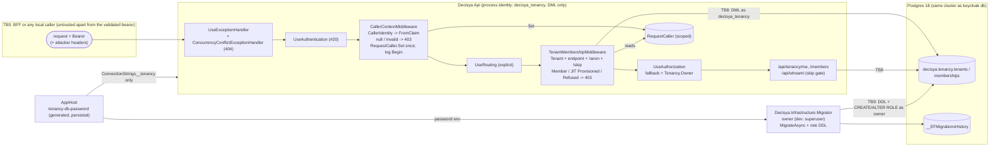

<!-- gate: G3 | verdict: PASS-WITH-NOTES | issue: #21 -->
# Threat delta: Modules.Tenancy, request-scoped caller, JIT provisioning, migrator role (issue #21)

- **Scope.** This is a delta on top of `tenant-query-filter.md` (#22) and `api-jwt-validation.md` (#20). It covers only what #21 adds:
  - `RequestCaller : ICurrentTenant, ICurrentCaller` and `CallerContextMiddleware`;
  - the new pipeline order;
  - `TenantMembershipMiddleware` and `TenantMembershipGate` (JIT provisioning);
  - the `Tenant` and `Membership` entities;
  - the `Tenancy.Owner` policy and the two endpoints;
  - `ConcurrencyConflictExceptionHandler`;
  - `Decisya.Infrastructure.Migrator` and the `decisya_tenancy` role;
  - the AppHost wiring;
  - `PostgresFixture.CreateEmptyDatabaseAsync`;
  - log enrichment.

  The #20 token validation and the #22 filter, guard and IL rules are not re-audited.
- **Mode.** Threat delta, written before code. G6 checks each MUST against the diff.
- **Inputs.**
  - `docs/ai/pipeline/21.md` (Marco's decisions of 2026-09-28);
  - `docs/requirements/phase-0/tenancy-module.md` (G1, Stories 1-6, NFR-31 to NFR-33);
  - `docs/architecture/tenancy-module.md` (G2, D1-D7, "Notes for G3");
  - the #22 boundary items B-1 to B-4 and #20's B-5;
  - the current code: `src/Decisya.Api` (`Program.cs`, `CallerIdentity`, `ApiAuthenticationBuilderExtensions`), `src/Decisya.ServiceDefaults/Logging` (`LogEnrichmentContext`, `UserIdHasher`), `TenantDbContext`, `PostgresFixture` and `AppHost.cs`;
  - `deploy/postgres/init/10-keycloak-db.sh`, `deploy/keycloak/decisya-realm.json` (user profile) and the realm guards in `tests/Decisya.Identity.Tests` (`RealmConfigurationTests`, `TenantSelfEditTests`).
- **ASVS.** 5.0 Level 2, mapped at section level as in the earlier deltas. Check requirement numbers against the official 5.0 text before copying them into a compliance artefact. "Access control" in the request maps to V8 (authorization) in 5.0. V4 (API and web service) is cited where the threat is about how the API trusts its input. #21 adds no authentication and no session, so the Level 3 chapters V6 and V7 are not touched.
- **Runs on:** host (manifest). That is correct: #21 adds no package, and `Microsoft.EntityFrameworkCore.Design` is already pinned. No secret value was read for this review.
- Ids T-xx, G4-21-xx and S-x are local to this file.
- Reviewer: security-reviewer agent, 2026-09-28.

## Verdict

**PASS-WITH-NOTES.** The G2 design closes #22's B-1 to B-4 and #20's B-5, and its fail-closed choices hold up. Five threats are rated High. Each has a mitigation in #21 that a MUST proves:

- T-01, cross-request tenant bleed;
- T-03, `Invalid` reaching an endpoint;
- T-05, membership inferred from the claim;
- T-06, tenant takeover through JIT;
- T-12, the API running with owner or DDL rights.

There are **five MUSTs** (G4-21-01 to G4-21-05). G3 adds three points that G2 does not cover:

1. **The role password statement can still reach the server log (T-14).** G2 sets `log_statement = 'none'`. Postgres also logs the text of any statement that **fails**, through `log_min_error_statement` (default `ERROR`), and inside a `DO … EXECUTE` the error `CONTEXT` repeats the inner SQL text. A failing `ALTER ROLE … PASSWORD '…'` therefore prints the password to the container log. The project's own precedent, `10-keycloak-db.sh`, already sets both `log_statement = 'none'` **and** `log_min_error_statement = 'panic'`. The migrator must do the same, or send a client-computed SCRAM-SHA-256 verifier instead of the cleartext password. The verifier also works for the non-superuser migrator of 0.16, where `SET log_*` is not allowed. This is in G4-21-05.
2. **The API must carry no owner credential at all (T-12).** An Aspire `WithReference(decisyaDb)` or `WithReference(postgres)` on `decisya-api` would inject `ConnectionStrings__decisya` with the superuser password next to the least-privilege string. Nothing in G2 forbids that. The AppHost test must assert that `ConnectionStrings__tenancy` is the API's only connection string. The Api tests must also prove `current_user = decisya_tenancy` **through the connection string the API actually received**, so that a fixture bug that leaves the API on the owner string cannot make the privilege test vacuous. This is in G4-21-05.
3. **Exactly one `ICurrentTenant` registration, and scoped dependencies taken per request (T-01).** "Scoped" is not enough if a second registration wins (last-registration-wins: a `TestCurrentTenant` or a module's own registration). The same applies to a convention-based middleware that receives `RequestCaller` in its constructor. That middleware is built once from the root provider, so it would share one instance across requests if scope validation were ever off. This is in G4-21-01.

The two further items the orchestrator asked about are both acceptable:
- `CreateEmptyDatabaseAsync` returning an owner connection string: test-only, in-process, Low (T-15), under the conditions in G4-21-05.
- The dev owner being Aspire's superuser until 0.16: accepted, and already deferred by G2 (T-13).

### Ratings of the items the orchestrator asked about

| Item | Rating | Outcome |
| --- | --- | --- |
| `RequestCaller` implementing both interfaces, scoped, set once, with DI scope validation (#22 B-1) | High if wrong (T-01, T-02); design correct | **G4-21-01** closes B-1 |
| Pipeline order (authentication → caller context → explicit `UseRouting` → membership gate → authorization), 403 for `Invalid` before routing (#22 B-2) | High if wrong (T-03, T-04); design correct | **G4-21-02** |
| JIT: can a crafted or edited `tenant_id` create or claim a tenant? | Crafted: no; #20 T-01 requires a realm-signed token. Edited: admin only; the realm guards already pin `edit: ["admin"]`, no identity providers and the unmanaged-attribute policy disabled. Claiming an **existing** tenant: refused (never join). Residual: an admin who assigns one new `tenant_id` to two users makes whoever signs in first the Owner (Low, admin-trust). | **G4-21-03** (T-05, T-06) |
| The 23505 race and its single re-read | Correct. Postgres raises 23505 only after the winner commits, so one re-read sees the winner. Needs `ChangeTracker.Clear()` and no ambient transaction (T-07). | **G4-21-03**; S-1 |
| `Tenant` keyed by its own `TenantId` | Correct and stronger than a surrogate key. The filter and the #22 guard reduce to "a tenant sees and creates only itself". EF forbids changing a key, so a tenant row cannot be moved. The FK `memberships.tenant_id → tenants.tenant_id` cannot point across tenants, because the guard pins `Membership.TenantId` to the current tenant (T-08). | Story 6 (G5); no MUST |
| `Tenancy.Owner` policy; generic 403 bodies | Correct (T-09). Two 403 shapes will exist: the generic ProblemDetails from the middleware, and the empty-body 403 from `JwtBearerHandler.HandleForbiddenAsync` when the Owner policy fails. G2's "every 403 is the same generic body" is therefore not literally true. Both shapes are acceptable, because neither carries a reason or a claim; G5 pins both. | **G4-21-02** |
| Concurrency handler (404, no values); `EnableSensitiveDataLogging` ban (#22 B-3) | High if wrong (#22 T-07); design correct. Extend the static ban to Npgsql's own detail switches (T-10). | **G4-21-04** |
| Migrator role: `decisya_tenancy` read/write and no DDL; the API connects only as that role; the generated password parameter; created idempotently on an existing volume | Grants correct (T-12). Password handling has one gap (T-14). Idempotence needs a test (T-13). | **G4-21-05** |
| `PostgresFixture.CreateEmptyDatabaseAsync` returning the owner string in-process | Low (T-15), with conditions | **G4-21-05** (conditions) |
| Log enrichment: `tenant_id` and the hashed user id | Correct. `UserIdHasher` is keyed HMAC-SHA256 (not reversible by dictionary). The values come from `CallerIdentity` and `TenantResolution`, never from a header (#20 B-5). Risk: a wrong or leaked `AsyncLocal` value mislabels records (T-11, Low). | Assert in **G4-21-01**'s concurrency test |

## Data flow and trust boundaries

- **TB5 (from #20).** Only the validated `sub` and `tenant_id` are trusted. Headers never supply identity (#20 G4-20-04). The claim's integrity rests on Keycloak: the attribute is editable by admins only.
- **TB8, API → database (new).** The API is a DML-only principal. The query filter (#22) is the tenant control. The role is the blast-radius control: no DDL, no migration history, no other schema.
- **TB9, migrator → database (new).** This is the only DDL principal. It also carries the only copy of the module role's password that crosses a process boundary as SQL.

## Threats

| Id | Element / flow | STRIDE | Threat | Severity | Mitigation | ASVS 5.0 id | Status |
| --- | --- | --- | --- | --- | --- | --- | --- |
| T-01 | `RequestCaller` lifetime | I, T | A singleton or shared `RequestCaller` (a second `ICurrentTenant` registration winning, a constructor-injected middleware, a captured scope) makes concurrent requests read each other's tenant (#22 T-14) | High | One scoped `RequestCaller`, both interfaces forwarded to it, exactly one descriptor each; `ValidateScopes` + `ValidateOnBuild` in every environment; middleware takes scoped services per `InvokeAsync` | V8.2, V8.4, V15.3 | G4-21-01 |
| T-02 | `RequestCaller.Set` | T | A second `Set` in the same scope switches tenant mid-request; `Find` then returns entities already tracked under the previous tenant, with no query (#22 T-14) | High | `Set` is internal and throws on a second call (also with identical values); before `Set`, `Resolution` is `default` (`Invalid`) and `UserId` throws | V8.4 | G4-21-01 |
| T-03 | Caller context, `Invalid` claim | E, I | A malformed `tenant_id` falls through to routing, an `[AllowCrossTenant]` handler or a query (#22 T-09, B-2) | High | 403 in `CallerContextMiddleware`, before `UseRouting`; no fallback to `None`; `null` identity → 403 | V8.2, V4.1 | G4-21-02 |
| T-04 | Pipeline order | E | An implicit `UseRouting` placed first by `WebApplication`, or the gate after `UseAuthorization`, lets the Owner handler run before the membership exists, or lets `Invalid` reach endpoint selection | Medium | Explicit `UseRouting` after `UseCallerContext` (G2 order); pinned by the "`Invalid` on an unknown path gives 403, not 401 or 404" test | V8.3, V15.3 | G4-21-02 |
| T-05 | Membership gate coverage | E | A future endpoint opts out with `SkipTenantMembership` (or `AllowAnonymous`) while touching tenant data, so the claim alone grants access (BOLA) | High | The gate is fail-closed by default; the opt-out set is exactly `{/api/whoami}` and the anonymous set exactly `{/health, /alive}`, both test-enforced | V8.2, V8.3 | G4-21-02 |
| T-06 | JIT provisioning, tenant takeover | E, S | (a) A forged claim creates or claims a tenant. (b) A user edits her own `tenant_id` to a victim's id. (c) A second user whose claim names an existing tenant is auto-joined, or wins the race and becomes Owner. (d) `None` (admin) provisions something. | High | (a) #20 signature and audience validation. (b) Admin-only attribute, pinned by the realm guards (`TenantSelfEditTests`, `RealmConfigurationTests`: `edit: ["admin"]`, no identity providers, unmanaged-attribute policy disabled). (c) An existing tenant is never joined; the race loser re-reads once and gets `Refused`. (d) The gate skips `None`, and the #22 guard throws `NoTenant` on a write. | V8.2, V8.3, V2.3 | G4-21-03 |
| T-07 | JIT under concurrency | T, D | Duplicate tenants or Owners; stale `Added` entries after 23505 re-inserted by a later `SaveChanges` in the same request; a retry loop; the re-read failing with `25P02` inside an ambient transaction | Medium | Tenant PK plus `ux_memberships_tenant_user`; one `SaveChanges` (tenant first); catch only `23505` on those two constraints; `ChangeTracker.Clear()`; exactly one re-read; no outer transaction | V2.3, V15.4 | G4-21-03; S-1 |
| T-08 | `Tenant` keyed by `TenantId`; FK | T, I | A tenant row moved or read across tenants; a cross-tenant FK used as an existence oracle (#22 T-16) | Low | Key immutable in EF; filter plus guard; FK target is the tenant itself; Story 6 isolation matrix | V8.2 | Story 6 (G5) |
| T-09 | `Tenancy.Owner`, 403 bodies | E, I | A `Member` or `None` caller lists members; a role read from a claim or the route; 403 bodies reveal which check failed or echo a claim | Medium | Handler reads the caller's own `Membership` (by `ICurrentCaller.UserId`) through the filter; `None` → 403; middleware 403 = ProblemDetails with `type`/`title`/`status`/`traceId` only and `no-store`; policy 403 = empty body (#20 shape); reason code only in the log | V8.2, V8.3, V16.5 | G4-21-02 |
| T-10 | Concurrency conflict and database error detail | I | A handler returns `GetDatabaseValues` or `Entries` (another tenant's row); `EnableSensitiveDataLogging` / `EnableDetailedErrors` put key values into exception text; Npgsql's `Include Error Detail` puts the 23505 `DETAIL` (`Key (tenant_id, user_id)=(…, <raw sub>)`) into exceptions and logs | High (#22 T-07) | 404 with `status` + `title`; no `Reload`/`GetDatabaseValues` (#22 rule); static ban on the EF switches, `AddDbContextPool`, `Include Error Detail` and Npgsql parameter logging | V16.5, V14.2, V13.4 | G4-21-04 |
| T-11 | Log enrichment | I, R | Raw `sub` or an `Invalid` claim value in logs; a record tagged with another request's `tenant_id` | Low | Keyed-HMAC hash (existing); `Begin` only after validation and only from `CallerIdentity` / `TenantResolution`, disposed with `using`; the 403 log carries a reason code only | V16.2, V16.3 | G4-21-01 (assert), G4-21-02 |
| T-12 | API database principal | E, T | The API runs as owner or superuser (an extra `WithReference`, a fixture that forgets to swap the user), so a SQL-injection or bypass bug can run DDL, read `__EFMigrationsHistory` or another database | High | `decisya_tenancy`: `NOSUPERUSER NOCREATEDB NOCREATEROLE NOINHERIT NOREPLICATION NOBYPASSRLS`, owns nothing, `USAGE` on `tenancy` only, table DML only, history revoked, `CONNECT` on `decisya` only (PUBLIC revoked; the `keycloak` database already revokes PUBLIC); the API receives only `ConnectionStrings__tenancy`; no `DatabaseFacade` in the API (G2 rule) | V13.2, V8.4, V15.2 | G4-21-05 |
| T-13 | Migrator idempotence; owner = superuser | T, D | Re-running on Marco's existing volume, or a pre-existing cluster-wide role (shared test container), fails or leaves stale grants; the dev owner is the superuser | Medium / Low | `duplicate_object` caught; `ALTER ROLE` and grants reapplied on every start; `WaitForCompletion` blocks the API when the migrator fails. Superuser owner accepted until 0.16 (G2 deferral). | V13.2 | G4-21-05; backlog |
| T-14 | Role password in transit to SQL | I | The password reaches the server log through a failing statement (`log_min_error_statement`, plpgsql `CONTEXT`), the migrator's own logs or exception text, or breaks quoting | Medium | Validate `^[A-Za-z0-9]{32,}$` before use (the key is named, the value never); `SET LOCAL log_statement = 'none'` **and** `SET LOCAL log_min_error_statement = 'panic'` (as in `10-keycloak-db.sh`), or a client-computed SCRAM-SHA-256 verifier; server-side `format('%L')`; never log the command or the connection string | V13.3, V16.2, V11.x | G4-21-05 |
| T-15 | `PostgresFixture.CreateEmptyDatabaseAsync` | I, E | An owner (superuser) connection string leaves the fixture: test output, assertion messages, `IConfiguration` dumps; or the API test host keeps it by mistake | Low | Test-only assembly (not referenced from `src/`); per-run random password (#22 T-18); derive the API string with `NpgsqlConnectionStringBuilder` (`Username`, `Password` replaced) and prove `current_user` | V13.3 | G4-21-05 (conditions) |
| T-16 | JIT on a `GET`; per-request lookups | D, T | State change on a safe method; two extra queries per request | Low | The write is idempotent and limited to the caller's own admin-assigned tenant; BFF cookie is `SameSite=Strict` (no cross-site GET with a session); lookups use the PK and the unique index | V2.3, V15.2 | Accepted |
| T-17 | Membership keyed by `sub` only | S | A second trusted issuer later produces a colliding `sub` | Low | One issuer, pinned (#20 S-1) | V10.3 | Backlog S-4 |

## Requirements for G4 (MUST)

Five MUSTs, all **fix-now**. Each names the red test that must fail before the code exists.

"No database access" is proved in one of two ways:
- the no-Docker factory with the placeholder `Host=db.invalid` (any query would throw and turn the 403 into a 500);
- in the Integration lane, a `DbCommandInterceptor` that records zero commands.

- **G4-21-01: one request-scoped caller, set once, with scope validation (closes #22 B-1; T-01, T-02, T-11).**
  - `RequestCaller` is registered once, as `AddScoped<RequestCaller>()`. `ICurrentTenant` and `ICurrentCaller` resolve to the same instance through `sp => sp.GetRequiredService<RequestCaller>()`.
  - The final `IServiceCollection` holds **exactly one** descriptor for each of `ICurrentTenant` and `ICurrentCaller`, and each is `Scoped`.
  - `UseDefaultServiceProvider(o => { o.ValidateScopes = true; o.ValidateOnBuild = true; })` is set in every environment.
  - `CallerContextMiddleware`, `TenantMembershipMiddleware` and the Owner handler receive `RequestCaller`, `ICurrentTenant`, `ICurrentCaller` and `TenancyDbContext` per request: as `InvokeAsync` parameters, or as a scoped `IMiddleware` or handler. Never through a singleton constructor.

  Red tests (`CallerContextTests`, Api tests):
  - descriptor count and lifetime, as above, over the Production host's service collection;
  - `Set` called twice throws `InvalidOperationException`, **also with identical values**;
  - before `Set`, `Resolution.Kind` is `Invalid` and `UserId` throws;
  - a Production host with an extra test-only singleton that takes `ICurrentTenant` fails at build (proves `ValidateOnBuild` plus `ValidateScopes` outside Development);
  - Integration: 2 × 25 interleaved parallel `GET /api/tenancy/me` requests as `dev-alice` and `dev-bob`. Every response's `tenant.id` is the caller's own. Every log record captured during a request carries that request's `tenant_id`, and `user_id` equal to `UserIdHasher.Hash(sub)`, never the raw `sub`.
- **G4-21-02: fail-closed pipeline, membership required by default, generic 403s (closes #22 B-2; T-03, T-04, T-05, T-09).**
  - The middleware order is exactly as in G2, with `UseRouting` called explicitly after `UseCallerContext`.
  - The gate runs whenever the resolution is `Tenant`, the endpoint is not null, it has no `IAllowAnonymous`, and it has no `SkipTenantMembershipMetadata`.
  - The Owner handler succeeds only for resolution `Tenant` **and** the caller's own `Membership.Role == Owner`, read through the filter.

  Red tests:
  - a validly signed token with `tenant_id` `not-a-guid`, the all-zero GUID and `0x…`: `GET /api/tenancy/me`, `GET /api/tenancy/members` **and `GET /api/does-not-exist`** all give 403, never 401, 404 or 500, with no database access. The 403 on the unknown path proves the check runs before routing.
  - `EndpointAuthorizationTests`: the set of endpoints carrying `SkipTenantMembershipMetadata` is exactly `{/api/whoami}`; the set carrying `IAllowAnonymous` is exactly `{/health, /alive}`; `/api/tenancy/members` carries `Tenancy.Owner`.
  - Story 1 scenario 4, on **both** routes: the tenant exists and the caller has no membership → 403, and no row is written.
  - Story 3 scenarios 2 and 3 (`Member` → 403; `None` → 403).
  - Response shape. Every middleware 403 is ProblemDetails with only `type`, `title`, `status` and `traceId`, and `Cache-Control: no-store`. The policy 403 is the #20 empty-body shape. No 403 body or header contains the `tenant_id` value, the `sub`, or any of the reason codes `InvalidIdentity`, `InvalidTenantClaim` or `MembershipRefused`. The captured log holds the reason code and never the claim value.
- **G4-21-03: JIT never claims an existing tenant, and the race is decided by the database (T-06, T-07).**
  - The gate follows G2's steps 1-4 exactly. The catch matches `PostgresException.SqlState == "23505"` **and** `ConstraintName` in {the `tenants` PK, `ux_memberships_tenant_user`}. Any other exception propagates as the generic 500.
  - After the catch, `ChangeTracker.Clear()`, then exactly one re-read.
  - The gate never runs inside an explicit or ambient transaction.
  - `Refused` is final for the request.

  Red tests (module tests on `PostgresFixture`, separate contexts):
  - N = 16 parallel `EnsureAsync` calls for one new `t` and **one** user give exactly one `Tenant` row and one `Owner` membership, and every call returns `Member` or `Provisioned` (NFR-32).
  - The same with **two** users: exactly one Owner. Every call made by the other user returns `Refused`, and that user has no membership row.
  - Pre-seed a tenant with no membership for `sub` X: X gets `Refused` and no row is written. Pre-seed a `Member` row for X: X gets `Member` (not upgraded).
  - Resolution `None`: `GET /api/tenancy/me` writes no row (Story 1 scenario 3).
  - A context whose `SaveChanges` throws a non-matching `DbUpdateException` (a fake with another `ConstraintName`) propagates it and does not re-read.
- **G4-21-04: a conflict returns nothing, and no switch prints database values (closes #22 B-3; T-10).**
  - `ConcurrencyConflictExceptionHandler` handles `DbUpdateConcurrencyException`, also when it arrives as an `InnerException`. It writes a 404 ProblemDetails with only `status`, `title`, `type` and `traceId`. It never calls `GetDatabaseValues(Async)`, `Reload(Async)` or `Entries`.

  Red tests:
  - the G2 test-only endpoint makes a real cross-tenant detached `Update` of tenant B's membership as tenant A. The result is 404. The body contains neither B's `tenant_id`, nor B's `user_id`, nor `Membership`, `tenant_id`, `user_id` or `memberships`. The log has the exception and a `trace_id`.
  - `ApiBoundaryTests`: no file under `src/**` (`*.cs` and `*.json`) contains `EnableSensitiveDataLogging`, `EnableDetailedErrors`, `AddDbContextPool`, `Include Error Detail`, `IncludeErrorDetail` or `EnableParameterLogging` (case-insensitive for the connection-string keyword).
  - The G4-21-03 race tests run with log capture at `Debug` for `Microsoft.EntityFrameworkCore`, `Npgsql` and `Decisya`. No record contains a raw `sub` or the other tenant's id.
- **G4-21-05: the API is DML-only, and the password stays out of every log (T-12, T-13, T-14, T-15).**
  - The migrator provisions the role exactly as G2 lists it, and is idempotent.
  - Before it connects, it validates `Migrator:TenancyRolePassword` against `^[A-Za-z0-9]{32,}$`. On failure it exits non-zero with a message naming the key, never the value.
  - It sets the password either:
    - under `SET LOCAL log_statement = 'none'` and `SET LOCAL log_min_error_statement = 'panic'` in the same transaction, or
    - as a SCRAM-SHA-256 verifier computed client-side (preferred; it also works for 0.16's non-superuser migrator).
  - It never logs a command text, a connection string or the password.
  - The API gets `ConnectionStrings__tenancy` and **no other** `ConnectionStrings__*`, and no `WithReference` to `postgres` or `decisya`.
  - `CreateEmptyDatabaseAsync` stays in `Decisya.TestInfrastructure`, and its return value is never written to test output or assertion messages. The API fixture builds the tenancy string with `NpgsqlConnectionStringBuilder`.

  Red tests:
  - `AppHostConfigurationTests`:
    - `decisya-api`'s environment has exactly one `ConnectionStrings__*` key, `ConnectionStrings__tenancy`, with `Username=decisya_tenancy`;
    - no `Migrator__*` key, and no Postgres superuser parameter;
    - `decisya-migrator` gets `ConnectionStrings__decisya` and `Migrator__TenancyRolePassword` only from the `tenancy-db-password` parameter;
    - the API waits for completion of the migrator.
  - Api Integration test, **using the connection string read from the API factory's `IConfiguration`**:
    - `SELECT current_user` returns `decisya_tenancy`;
    - `CREATE TABLE`, `CREATE TEMP TABLE`, `ALTER TABLE tenancy.tenants …`, `DROP TABLE`, `TRUNCATE tenancy.memberships`, `CREATE SCHEMA` and `SET ROLE postgres` each fail with `42501`;
    - `SELECT` on `tenancy."__EFMigrationsHistory"` fails with `42501`;
    - DML on both tables succeeds;
    - `pg_roles` shows `rolsuper`, `rolcreatedb`, `rolcreaterole`, `rolbypassrls` and `rolreplication` false for the role;
    - `pg_auth_members` has no row for it;
    - connecting to the `postgres` maintenance database or to the `keycloak` database, if present, is refused or returns no readable table.
  - `MigrationRunner` run **twice** against the same database, and once against a second database in the same container while the role already exists: every run succeeds, and the privilege test above still holds.
  - The migrator run with a password containing `'` or shorter than 32 characters exits non-zero. The message names `Migrator:TenancyRolePassword` and not the value.
  - Log capture at `Debug` over a full migrator run: no record contains the password, `Password=` or the owner connection string.

G6 checks that need no new test:
- the Tenancy DTOs expose only the fields G2 lists (no `created_at`, no raw claim);
- the gate and the handlers log no `sub`, no claim value and no connection string;
- `Decisya.Api.csproj` references `Decisya.Modules.Tenancy` and not `Decisya.Infrastructure.Migrator` or `Decisya.TestInfrastructure`;
- `dotnet list package --vulnerable --include-transitive` shows no High or Critical for `Decisya.Api` and `Decisya.Infrastructure.Migrator`.

## SHOULD

**Fix-now (Low; a few lines in files this PR creates):**
- **S-1 (T-07).** Put a code comment on the gate's catch saying why there is no retry loop and no outer transaction. Also add a `Debug.Assert(Database.CurrentTransaction is null)` or an equivalent guard, so that a later Wolverine or outbox transaction around the request fails loudly instead of turning the re-read into `25P02`.
- **S-2 (T-09).** Correct G2's "every 403 is the same generic body" in the PR body: two shapes exist, and both carry no reason. Alternatively, add an `IAuthorizationMiddlewareResultHandler` that writes the same ProblemDetails for a policy 403. If G4 chooses that, #20's `ForbiddenResponseTests` change, and the PR body must say so.

**Backlog (#83):**
- **S-3 (T-06).** A realm guard that `tenant_id` is emitted only by the `oidc-usermodel-attribute-mapper` on `decisya-bff`: no hardcoded-claim, session-note or script mapper and no client scope emits it. A hardcoded `tenant_id` would make every user's first sign-in race for the same tenant.
- **S-4 (T-17).** Key memberships by (`iss`, `sub`), or record the issuer, before a second issuer or identity provider is added.
- **S-5 (T-13).** A dedicated non-superuser owner or migrator role and production credentials (0.16), plus `REVOKE CONNECT ON DATABASE postgres FROM PUBLIC` in the init scripts. This joins G2's deferred list.
- **S-6 (T-16).** Revisit JIT on a safe method when invitations (#83) bring an explicit onboarding `POST`.

## Carry-in status

| Item | Closed by |
| --- | --- |
| #22 B-1 (High, scoped and set-once `ICurrentTenant`, scope validation) | G4-21-01 |
| #22 B-2 (`Invalid` → 403 before routing) | G4-21-02 |
| #22 B-3 (conflict → generic 404, no sensitive-data logging) | G4-21-04 |
| #22 B-4 (`ArchitectureScope` completeness) | G2's `ArchitectureScopeTests` (G5); no G3 change |
| #20 B-5 (no `tenant_id` → no tenant data; enrichment from `CallerIdentity`; unparsable → 403) | G4-21-01, G4-21-02, G4-21-03 (`None` writes nothing) |

## Residual risk after #21

- Tenant integrity rests on Keycloak administrators: whoever can edit a user's `tenant_id` decides which new tenants exist and who owns them. Existing tenants cannot be claimed.
- There is still no database-level tenant defence (RLS deferred, ADR-0001). The DML-only role limits the blast radius but does not isolate tenants.
- The dev owner is the Postgres superuser until 0.16.

## Proportion note

T-08, T-16 and T-17 are recorded for completeness and change nothing in the merge decision. No High or Medium flaw was found in code that #21 does not touch.
