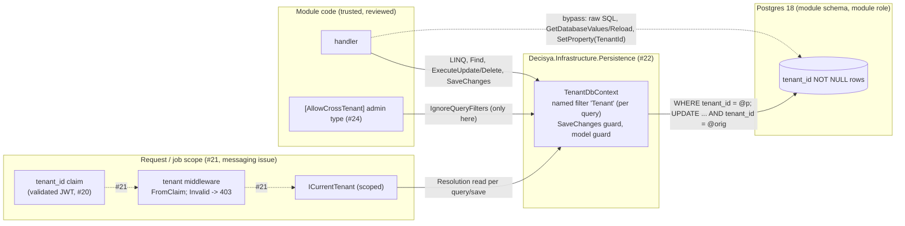

<!-- gate: G3 | verdict: PASS-WITH-NOTES | issue: #22 -->
# Threat delta: global tenant query filter and ITenantScoped rules (issue #22)

- Scope: what #22 adds. That is `ITenantScoped`, `TenantResolution`, `ICurrentTenant` and `[AllowCrossTenant]` in SharedKernel.Tenancy; `TenantDbContext` with its named filter, `SaveChanges` guard and model guard; the four architecture rules; and `PostgresFixture`. There is no endpoint, no host middleware (#21), no message and no new package.
- Mode: threat delta, written **before** implementation. "Requirements for G4" is design input for backend-dev and platform-dev (G4) and test-engineer (G5). G6 checks each MUST against the diff.
- Inputs: `docs/requirements/phase-0/tenant-query-filter.md` (G1, Stories 1-9 and the three adopted answers), NFR-28 to NFR-30, `docs/architecture/tenant-query-filter.md` (G2, including "Notes for G3"), ADR-0001, ADR-0005, CLAUDE.md invariant 1, and the #32 threat delta (`tenantid-result-types.md`, F-2 comes due here).
- ASVS: 5.0, Level 2. Mapped at section level, following the #32 precedent. Check requirement numbers against the official 5.0 text before copying them into a compliance artefact. V6 and V7 (the Level 3 chapters) are not touched, because #22 adds no authentication and no session.
- Ids T-xx and G4-22-xx are local to this file. #27 (0.15) absorbs them into the baseline.
- Reviewer: security-reviewer agent, 2026-09-28.

## Verdict

PASS-WITH-NOTES. The G2 design is sound, and its fail-closed choices hold up. It has **five MUSTs** (G4-22-01 to G4-22-05). Two of them close gaps that G2 did not list:

1. **The concurrency token creates a new read-back path (T-07, High once #21 has handlers).** A detached cross-tenant `Update` now raises `DbUpdateConcurrencyException`. The textbook handler for that exception calls `entry.GetDatabaseValuesAsync()` or `ReloadAsync()`. As I read EF Core's `EntityFinder`, it builds that query with `IgnoreQueryFilters()`, by design, so a filtered-out row can still be reloaded. If so, tenant A gets tenant B's current row back. I did not verify this against the binary; the G4-22-03 red test decides it. In both cases, these four members go on the bypass list. (Confirmed at G4 on 2026-09-28; see the T-07 note.)
2. **The IL rule's "outermost type" credit is too broad, and `call` alone is too narrow (T-10).** A user-declared nested helper class inside an attributed type would inherit the permission. A method-group reference (`ldftn`) or an expression-tree reference (`ldtoken`) to `IgnoreQueryFilters` would not be seen at all.

One High has no mitigation inside #22: T-14, the `ICurrentTenant` lifetime. It is linked to #21 as boundary requirement B-1. That is a linked issue, not a BLOCK.

G2 detail confirmed from the local EF Core 10.0.4 XML docs: both `IgnoreQueryFilters` documentation IDs in the architecture note are exact. EF 10's `ExecuteUpdate` takes `Action<UpdateSettersBuilder<T>>` (a delegate, not an expression tree), and `SetProperty` is a real call. G4-22-05 relies on this.

## Data flow and trust boundaries

This is a library with no I/O of its own, apart from the test fixture. The model covers how its callers can misuse it. Dashed flows arrive with the issue named in the label.

Boundary #22 owns: **module code → rows**. Every path across it must either go through the filter and the guard, or sit in an `[AllowCrossTenant]` type that the architecture rules can see. The claim → `ICurrentTenant` boundary belongs to #21.

## Threats

| Id | Element / flow | STRIDE | Threat | Severity | Mitigation | ASVS 5.0 id | Status |
| --- | --- | --- | --- | --- | --- | --- | --- |
| T-01 | Filter evaluation | I, E | The tenant gets captured into the compiled model, which EF caches per context type, so every later context uses the first tenant. | High | Filter closes over `this` and reads `CurrentTenantFilter` on each execution (G2). Proven by the two-contexts test and the compiled-query case (G4-22-01). | V8.4, V8.2 | Mitigated by G4-22-01 |
| T-02 | `default(TenantResolution)` | E, I | An unpopulated `ICurrentTenant` (missing middleware, a background job) is treated as "no tenant" or as a tenant. | High | `default` is `Invalid`. `Invalid` throws while parameters are extracted, before any SQL is sent. `TenantId` getter throws unless the kind is `Tenant` (G4-22-01). | V8.2, V15.3 | Mitigated by G4-22-01 |
| T-03 | `None` resolution | I | "No tenant" becomes "all tenants", for example through `@p IS NULL OR …` or a dropped predicate. | High | A `NULL` parameter against a `NOT NULL` column matches no row. The column is required by the model. Proven for collection, `Find`, `Count`/`Any`, `ExecuteUpdate`/`ExecuteDelete` (G4-22-01). | V8.4, V8.2 | Mitigated by G4-22-01 |
| T-04 | `SaveChanges` guard | T | A row is written untenanted, into another tenant, or moved to another tenant through the change tracker. | High | Sealed overloads, explicit `DetectChanges`, the six-row table in G2 (G4-22-02). | V8.4, V8.3 | Mitigated by G4-22-02 |
| T-05 | Detached `Update`/`Remove` by id | T, E | `ctx.Update(new X(idOfB, tenantA))` passes the guard (original = current = A) and would reach B's row through a key-only `WHERE`. | High | `TenantId` is a concurrency token, so the `WHERE` carries `tenant_id = @orig`, which gives 0 rows and `DbUpdateConcurrencyException`. The rule asserts the token (G4-22-02). | V8.2 (BOLA), V8.4 | Mitigated by G4-22-02 |
| T-06 | Raw SQL APIs | I, T | `Database.ExecuteSql*`, `SqlQuery*`, `GetDbConnection` skip the filter entirely. The `*Raw` variants add SQL injection. `FromSql*` on a `DbSet` composes with the filter, so it is not a filter bypass. | Medium (High with a first raw query) | Add them to the bypass list, so each one needs `[AllowCrossTenant]` with a justification (G4-22-03). | V8.4, V1.2 | Mitigated by G4-22-03 |
| T-07 | `EntityEntry.GetDatabaseValues(Async)` / `Reload(Async)` | I | The query is built with filters ignored (to be confirmed by the red test). Chain: cross-tenant detached update → concurrency exception → textbook conflict handler reads the "database values" → B's row is returned to A. Attaching a stub with B's id and calling `Reload` does the same. | High (once #21 has write handlers) | Add all four to the bypass list whatever the red test shows. Conflict handlers return a generic 404/409 and never the database values (B-3) (G4-22-03). Confirmed at G4; see the note below. | V8.2, V8.4 | Mitigated by G4-22-03 (ban) + pinned tests (see note) |
| T-08 | `ExecuteUpdate(s => s.SetProperty(e => e.TenantId, …))` | T | This moves the caller's own filtered rows into another tenant. `SaveChanges` never sees it. It breaks Story 5 ("can't … move data into someone else's tenant"). | Medium | IL rule: a method that calls `UpdateSettersBuilder<T>.SetProperty` and loads a `get_TenantId` token fails (G4-22-05). Residual: a selector built in another method. | V8.4, V8.3 | Mitigated by G4-22-05; residual → backlog |
| T-09 | `[AllowCrossTenant]` + `IgnoreQueryFilters` | E | The getter is never read, so an `Invalid` caller also reaches the cross-tenant query. | Low | #21's middleware rejects `Invalid` before any handler (B-2). #24's admin handlers carry an admin-role policy. The type is compile-time reviewed. | V8.2, V8.4 | → #21 B-2, #24 |
| T-10 | `CrossTenantQueryRule` coverage | E | (a) A user-declared nested type in an attributed class inherits the permission and is callable from anywhere. (b) `ldftn`/`ldvirtftn` (method group) and `ldtoken` (expression tree) references are missed. (c) `GenericInstanceMethod` is compared by reference instead of by element method. | High (the rule is the only authoritative guard) | Credit only through compiler-generated nesting. Match every opcode that references a method. Match on the resolved element method (G4-22-04). Reflection by string stays undetectable (residual). | V8.4, V15.3 | Mitigated by G4-22-04 |
| T-11 | BannedSymbols escape | E | A local `#pragma`, `[SuppressMessage]`, `<NoWarn>RS0030`, or `.editorconfig` severity silences RS0030. | Low | RS0030 is fast feedback only. The IL rule ignores suppressions and is authoritative, so the pragma's ease is acceptable. SHOULD S-3. | V15.3 | Accepted |
| T-12 | Module assemblies outside `ArchitectureScope` | E | A module that forgets to add itself escapes the IL rules. The runtime model guard still catches unscoped entities, but not bypass calls. | Medium (from #21) | Scope completeness test (B-4). | V8.4, V15.3 | → #21 B-4 |
| T-13 | Model rewritten after the base | T | A custom `IModelFinalizingConvention` or a replaced `IModelCustomizer` swaps the `Tenant` filter body; the rule checks only that the filter exists. | Low | SHOULD S-2. | V8.4 | Backlog |
| T-14 | `ICurrentTenant` lifetime and mutability (#21) | I, T | A singleton, or a scoped instance that can be changed mid-scope, lets concurrent requests read each other's tenant. After a switch, `Find` also returns entities already tracked under the previous tenant with no query, so the filter never runs. | High | Scoped, set-once implementation (B-1). G2's "switch A→B on one context" test proves only that nothing is cached, not a supported pattern. | V8.4, V8.2 | → #21 B-1 |
| T-15 | Future Wolverine outbox entities | E | Envelope entities are not `ITenantScoped`, so the model guard rejects them (fail-closed). The risk is the fix: a namespace or prefix skip-list in the guard. | Low (for #22) | Messaging issue: a separate outbox `DbContext`, or an exact-type allow-list with an ADR-0001 amendment; never a pattern skip (F-2). | V8.4 | → messaging issue |
| T-16 | Cross-tenant foreign keys | I | A's row can reference B's id: FK constraints check existence without the filter. The result is an existence oracle, and A's required navigations silently drop rows. | Low (UUIDv7 ids) | Composite `(tenant_id, id)` principal keys for tenant-scoped FKs (module-scaffold). | V8.2 | Backlog |
| T-17 | `TenantIsolationException` / EF logs | I | Tenant ids or row values reach a message, or EF sensitive-data logging prints parameters. | Low | Fixed message per violation, CLR type names only (G4-22-02 canary). No `EnableSensitiveDataLogging` outside tests (B-3). | V16.5, V13.4 | Mitigated; → #21 B-3 |
| T-18 | `PostgresFixture` | S, I | Testcontainers publishes the port on all host interfaces. A fixed password would expose a superuser Postgres on the LAN while tests run. The database name is an identifier and can't be a parameter. | Low | Per-run random password (`RandomNumberGenerator`), never printed, connection string never public. Name `t_`+32 hex generated by the fixture and quoted. Image pinned by digest, Ryuk on. | V13.3, V11.5, V1.2 | Accepted (G2 design) |
| T-19 | Pooling / compiled model | E | `AddDbContextPool` would share one `ICurrentTenant`. `UseModel(compiled)` skips `OnModelCreating` and the guard with it. | Low | The constructor convention makes pooling fail at startup. `TenantModelRule` inspects the final `.Model`, so a compiled model without the filter or token fails the rule. | V8.4 | Mitigated (G2 design) |

**T-07, confirmed at G4 (2026-09-28).**
- Result: on real Postgres 18 (`tests/Decisya.Infrastructure.Persistence.Tests/CrossTenantReadBackTests.cs`), as tenant A, attaching a stub with tenant B's row id and calling `GetDatabaseValuesAsync()` or `ReloadAsync()` returns tenant B's real row. EF bypasses the global query filter on these paths.
- Decision (Marco, 2026-09-28): the control is the `CrossTenantQueryRule` ban (G4-22-03). The four methods are allowed only in `[AllowCrossTenant]` types. The two integration tests pin the hazard: they assert that EF leaks and cite the ban, so an EF upgrade that changes the behaviour shows up. #21 B-3 stays: a conflict never returns database values. There is no runtime guard in #22.
- Residual risk: inside an `[AllowCrossTenant]` handler these methods can read any tenant. That is the purpose of the attribute, and #24 audits those types (F-4).
- G6 check: the test file on disk at the time of this note still asserts no leak (`databaseValues.Should().BeNull`, `entry.State` `Detached`). G6 confirms that both tests assert the leak and cite G4-22-03.

### Ratings of the items G2 and the orchestrator asked about

| Item | Rating | Outcome |
| --- | --- | --- |
| `ExecuteUpdate` + `SetProperty(TenantId)` | Medium (T-08) | MUST G4-22-05 (IL rule) |
| `ExecuteSql*` / raw SQL | Medium, High at the first raw query (T-06) | MUST G4-22-03 (bypass list) |
| `[AllowCrossTenant]` skipping the `Invalid` check | Low (T-09) | #21 B-2; #24 admin policy |
| Wolverine outbox entities | Low for #22 (T-15) | Messaging issue, F-2 |
| Filter reads `ICurrentTenant` per query | Correct; High if wrong (T-01) | MUST G4-22-01 proves it |
| `default(TenantResolution)` = `Invalid` | Correct, fail closed (T-02) | MUST G4-22-01 |
| `None` → zero rows | Correct (T-03) | MUST G4-22-01, including bulk operations |
| Concurrency-token guard | Correct, but it creates T-07 | MUST G4-22-02 + G4-22-03 |
| IL scan crediting nested types | Too broad and too narrow (T-10) | MUST G4-22-04 |
| BannedSymbols as the guard; pragma escape | Low (T-11); the IL rule is authoritative | Accepted; S-3 |
| `PostgresFixture` random password, database per call | Low (T-18); design is right | Accepted |

## Requirements for G4 (MUST)

Every MUST names its red test. "Before any SQL" means that a `DbCommandInterceptor` registered on the test context records zero commands.

- **G4-22-01 (resolution fails closed, and it is read per query).**
  - `default(TenantResolution).Kind` is `Invalid`. `TenantResolution.TenantId` throws unless the kind is `Tenant`. `For(default)` throws. `FromClaim` behaves like this: `null` → `None`; canonical GUID → `Tenant`; `""`, whitespace, `not-a-guid`, the all-zero GUID, and the #32 compatibility forms (`0x…`, `+…`) → `Invalid`.
  - With `Invalid` (including a `TestCurrentTenant` nobody set), each of these throws `TenantIsolationException(InvalidTenant)` (or an exception with that as its inner exception) before any SQL: a collection query, `FindAsync`, `CountAsync`, `ExecuteUpdateAsync`, `ExecuteDeleteAsync`, `SaveChangesAsync`.
  - With `None`, a collection query, `FindAsync(existing id)`, `CountAsync` and `AnyAsync` return 0 rows, false or null, and `ExecuteUpdateAsync`/`ExecuteDeleteAsync` affect 0 rows, against two seeded tenants on Postgres.
  - No cached tenant: two contexts of the same type (A, then B) each see only their own row, and so does an `EF.CompileAsyncQuery` delegate run against both contexts.
- **G4-22-02 (the write guard and the concurrency token).**
  - The G2 guard table is implemented, and each of the six rows has a test.
  - The guard also runs with `ChangeTracker.AutoDetectChangesEnabled = false` (the test changes `TenantId` through `entry.Property(...).CurrentValue` with auto-detect off).
  - As A, a detached `Update(new Probe(idOfB, tenantA))` and a detached `Remove(...)` raise `DbUpdateConcurrencyException`, and B's row is re-read unchanged through B's context.
  - `TenantModelRule` fails on a fixture context whose entity's `TenantId` is not a concurrency token (a violation fixture that sets `IsConcurrencyToken(false)` through a model-finalizing convention, or equivalent).
  - Canary: the `TenantIsolationException` `Message` and `ToString()` contain neither tenant GUID nor the entity's `Name` value.
- **G4-22-03 (bypass list: one list, enforced by `CrossTenantQueryRule`).** The rule treats every reference to any of these methods (all overloads, matched by declaring type full name and method name) exactly as it treats `IgnoreQueryFilters`, so the method is allowed only in an `[AllowCrossTenant]` type with a justification:
  - `EntityFrameworkQueryableExtensions.IgnoreQueryFilters`;
  - `RelationalDatabaseFacadeExtensions.ExecuteSql`, `ExecuteSqlAsync`, `ExecuteSqlInterpolated`, `ExecuteSqlInterpolatedAsync`, `ExecuteSqlRaw`, `ExecuteSqlRawAsync`, `SqlQuery`, `SqlQueryRaw`, `GetDbConnection`;
  - `EntityEntry.GetDatabaseValues`, `GetDatabaseValuesAsync`, `Reload`, `ReloadAsync` (the generic `EntityEntry<T>` inherits them).

  Red tests:
  - one violation fixture type per group (raw SQL, entry reload); each fails the rule and is named;
  - an integration test on Postgres: as A, attach a stub with B's id and call `GetDatabaseValuesAsync()`. Record the result in G4 evidence. If it returns B's values, T-07 is confirmed. The ban stands either way.

  `Decisya.TestInfrastructure` is outside `ArchitectureScope`, so its `CREATE DATABASE` is not affected.
- **G4-22-04 (`CrossTenantQueryRule` sees every reference and credits narrowly).**
  - **Opcodes.** The rule inspects `call`, `callvirt`, `newobj`, `ldftn`, `ldvirtftn` and `ldtoken` operands that are method references. It resolves a `GenericInstanceMethod` to its `ElementMethod` before comparing.
  - **Walking to the outer type.** It walks to the declaring type **only while the current type is compiler-generated**, that is, it carries `[CompilerGenerated]` or its name starts with `<`. A user-declared nested type must carry its own attribute.

  Red fixtures in `TenancyViolations`:
  - a method-group use (`Func<IQueryable<T>, IQueryable<T>> f = EntityFrameworkQueryableExtensions.IgnoreQueryFilters;`);
  - an expression-tree use (`Expression<Func<IQueryable<T>, IQueryable<T>>> e = q => q.IgnoreQueryFilters();`);
  - `[AllowCrossTenant("…")] class Outer { public static class Helper { /* IgnoreQueryFilters */ } }`, where the rule must name `Outer+Helper`.

  The compliant async-plus-lambda fixture from G2 stays green.
- **G4-22-05 (no bulk tenant move).** `TenantIdImmutabilityRule`, or a sibling rule, fails any method whose body both calls `Microsoft.EntityFrameworkCore.Query.UpdateSettersBuilder`1::SetProperty` (either overload) and has an `ldtoken` for a `get_TenantId` method declared on `ITenantScoped` or on a type that implements it. The walk to the outermost type follows G4-22-04, so the error names the handler. `[AllowCrossTenant]` does **not** exempt this: moving a row between tenants is never allowed. Red fixture: `ctx.Probes.ExecuteUpdateAsync(s => s.SetProperty(p => p.TenantId, other))`. Green fixture: `SetProperty(p => p.Name, "x")` in a type whose predicate uses `p.TenantId` in a separate `Where`.

## SHOULD (this PR if cheap, otherwise backlog #83)

- **S-1.** Add BannedSymbols entries (message "Tenant filter bypass: only in [AllowCrossTenant] types (ADR-0001)") for the G4-22-03 members as well, with a compile-fixture proof that RS0030 fires for each new entry. `BannedSymbolsSyncTests` is text-only and cannot tell whether an ID is wrong.
- **S-2.** `TenantModelRule` also checks that the `Tenant` filter's body is the one `TenantDbContext` built. Compare it against a filter built by the base, or check that it reads `CurrentTenantFilter`, not only that the named filter exists (T-13).
- **S-3.** A text test that no `src/**` project file, `Directory.Build.*` or `.editorconfig` lowers RS0030 or adds it to `NoWarn` (T-11).
- **S-4.** `[AllowCrossTenant]` types use the named overload `IgnoreQueryFilters([TenantDbContext.TenantFilterName])`, so a later soft-delete filter keeps working. G6 checks this.
- **S-5.** Extend the bypass list to direct Npgsql use in module assemblies (`NpgsqlDataSource`, `NpgsqlConnection`, `NpgsqlCommand`), once a module references Npgsql directly.

## #21 boundary (Modules.Tenancy and the API host)

- **B-1 (High, T-14).** The production `ICurrentTenant` is registered **Scoped** and is **set once**: a second set in the same scope throws. The DI container is built with `ValidateScopes` and `ValidateOnBuild`. Tests: the registered lifetime is Scoped; set twice throws; two concurrent requests with different tenants each see only their own rows.
- **B-2 (T-09).** The middleware resolves `FromClaim` and returns a generic 403 for `Invalid` before routing reaches any handler, `[AllowCrossTenant]` ones included. There is no fallback to `None`.
- **B-3 (T-07, T-17).** Handlers map `DbUpdateConcurrencyException` and "not found" to the same generic response (404), never returning database values or distinguishing "exists in another tenant". No `EnableSensitiveDataLogging` outside Development and tests.
- **B-4 (T-12).** `ArchitectureScope` completeness: a test fails when any `src/**/Decisya.Modules.*` project (excluding `.Contracts`) is missing from `ArchitectureScope.Assemblies`. module-scaffold step 7 already adds it; this test proves it.

## Follow-ups (link, don't implement in #22)

| Id | Owner | Item |
| --- | --- | --- |
| F-1 | #83 backlog | T-08 residual: a runtime or database guard against tenant moves (a `BEFORE UPDATE OF tenant_id` trigger per table, or the deferred ADR-0001 RLS option), because the IL rule misses a selector built in another method. |
| F-2 | Messaging issue (ADR-0005) | Outbox entities (T-15): a separate `DbContext`, or an exact-type allow-list with an ADR-0001 amendment. Never a pattern skip in the model guard. Wolverine handlers set `ICurrentTenant` from the envelope under B-1's set-once rule. |
| F-3 | #83 backlog (module-scaffold) | Composite `(tenant_id, id)` principal keys for FKs between tenant-scoped entities (T-16). |
| F-4 | #24 | Audit every `[AllowCrossTenant]` type from reflection (Story 6 scenario 4), including the G4-22-03 raw-SQL users, and require an admin-role policy on those handlers (T-09). |
| F-5 | #27 (0.15) baseline | Absorb T-01 to T-19. The #32 F-2 item is closed by G4-22-01 and G2's converter. |

## Residual risk after #22

- Reflection by string (`GetMethod("IgnoreQueryFilters")`) and a `SetProperty` selector built outside the calling method evade the IL rules. G6 review is the control until RLS or a trigger (F-1).
- Everything rests on the ArchitectureTests running in CI over a complete scope (B-4) and on #21's scoped, set-once `ICurrentTenant` (B-1).
- Postgres RLS stays deferred, per ADR-0001. There is no database-level defence in depth yet.
