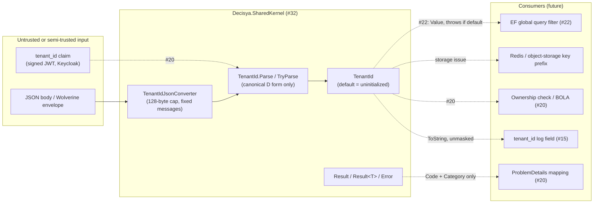

<!-- gate: G3 | verdict: PASS-WITH-NOTES | issue: #32 -->
# Threat delta: SharedKernel TenantId and result types (issue #32)

- Scope: what #32 adds to `Decisya.SharedKernel`: `TenantId`, `TenantIdFormatException`, the internal `TenantIdJsonConverter`, `Error`, `ErrorCategory`, `Result` and `Result<T>`. No endpoint, no data store, no message, no package.
- Mode: threat delta, done **before** implementation. "Requirements for G4" is design input for backend-dev (G4) and test-engineer (G5). G6 checks each requirement against the diff.
- Inputs: `docs/requirements/phase-0/tenantid-result-types.md` (G1, Stories 1-5), NFR-13 and NFR-14, `docs/architecture/tenantid-result-types.md` (G2, including "Notes for G3"), Marco's decisions in `docs/ai/pipeline/32.md`, ADR-0001, ADR-0005, CLAUDE.md invariant 1 and the errors principle, and `docs/security/threat-models/apphost-servicedefaults.md` (#15: log fields, masking core, T-19).
- ASVS: 5.0, Level 2. Mapped at **section** level, as in #15. Check requirement numbers against the official 5.0 text before copying them into a compliance artefact. V6 and V7 (Level 3 chapters) are not touched: #32 adds no authentication and no session.
- Threat ids T-xx and requirement ids G4-32-xx are local to this file. #27 (0.15) absorbs them into the baseline.
- Reviewer: security-reviewer agent, 2026-09-26.

## Verdict

PASS-WITH-NOTES. No threat is High today, because nothing calls these types yet. Three Mediums become High the moment #20 and #22 wire them in: T-02 (non-canonical text accepted), T-04 (the default `TenantId` reaching a key or an ownership check) and T-08 (an ignored authorization `Result`). #32 closes the library side of each. The consumer side is linked to #20, #22, the messaging issue and the storage issue (Follow-ups F-1 to F-4).

The G2 design is sound. G3 changes three details of it, and backend-dev follows these where they differ from the architecture note:

1. **`D` parsing needs an explicit character check (T-02).** `Guid.TryParseExact(…, "D")` keeps .NET's legacy compatibility parsing. A component may start with `0x`, `0X` or `+` as long as the component length is unchanged, so `0x5b1407-351d-4694-9392-03acc5870eb1` and `005b1407-351d-4694-9392-03acc5870eb1` parse to the same GUID. That breaks G2's claim that two different strings can never name the same tenant. After trimming, `TryParseCore` checks the shape itself: exactly 36 characters, `-` at indexes 8, 13, 18 and 23, and `char.IsAsciiHexDigit` everywhere else. Only then does it call `Guid.TryParseExact`. This check also rules out non-ASCII digits, independent of runtime internals.
2. **A length cap before trimming (T-03).** Reject input longer than 64 characters before the whitespace trim runs, so rejection costs O(1) and doesn't depend on the input. G1's padded variants (at most 3 plus 3 whitespace characters, 42 in total) stay well inside the cap.
3. **The robustness property test must reach the compatibility forms (T-02).** G2's random character set (hex, `-`, braces, whitespace, control, non-ASCII) contains no `+`, `x` or `X`, so it can never generate the compatibility forms. Add those three characters to the generator, and add the explicit cases in G4-32-01.

The G2 design settles the rest, and G3 confirms it: the `D`-only format, the 128-byte JSON pre-check, no input in `TenantIdFormatException`, `[JsonIgnore]` on `Error.Message`, the `Error.Code` pattern, `Write` throwing for the default `TenantId`, and no `IParsable`. Each one is pinned by a requirement below, so G6 can check it.

## Evidence (2026-09-26, code reading)

- `SensitiveTypeAnalyzer.IsScalar` does not list `TenantId`. Its public properties are only `Guid Value` and `bool IsInitialized`, both scalars with no `[Sensitive]`, so `NeedsProcessorRendering` is false. The value then passes through unchanged, and the sink formats it with `ToString()`. That is the result G1 Story 3 scenario 3 wants, with no ServiceDefaults change. If `TenantId` ever gains a non-scalar property, the result changes, and G4-32-12 catches that.
- `tenant_id` contains none of the #15 deny-list fragments (`token`, `secret`, and so on), so the key isn't masked either.
- If an `Error` is logged as an object, the processor renders it: `Error` is a Decisya-declared type with a `string` member that needs shape masking. `Message` then reaches the log, after `MaskString` (JWT and bearer shapes, length cap). This is the intended "full detail to the log", and it is why G4-32-14 constrains what `Message` may contain.
- `InvalidCurrencyCodeException` echoes a sanitised 16-character preview. `TenantIdFormatException` echoes nothing, which is stricter and correct.

## Data flow and trust boundaries

A library with no I/O. The model covers how future callers can misuse it. Dashed flows don't exist yet; the owning issue is in the label.

The trust boundary that #32 prepares is **text becoming a `TenantId`**. Today, the only live path across it is JSON deserialisation, and only in tests. From #20 onward, the claim path crosses it on every request.

## Threats

| Id | Element / flow | STRIDE | Threat | Severity | Mitigation | ASVS 5.0 id | Status |
| --- | --- | --- | --- | --- | --- | --- | --- |
| T-01 | `Parse` / converter: `Guid.Empty` | S, E | The all-zero GUID gets accepted as a tenant and becomes a shared "null tenant" that unrelated callers fall into. | Medium | Rejected in `From`, `Parse`, both `TryParse` overloads and the converter (G4-32-03). | V2.2, V8.4 | Mitigated by requirements |
| T-02 | `Parse`: canonicalisation | T, S | Several strings name one tenant: case, padding, and the legacy `0x` / `+` forms of `Guid`'s `D` format. A consumer that keys a cache, a lock, a rate limit or an audit search on the **raw** claim text treats one tenant as two, or misses entries in a search. | Medium (High once keys exist) | Explicit shape check before `TryParseExact` (change 1). Canonical lowercase `ToString()`. Keys are built from `TenantId`, never from raw text (F-4). | V1.1, V2.2 | Mitigated by requirements; → F-4 |
| T-03 | `Parse` / converter: size | D | Unbounded input: a multi-megabyte claim or JSON string is allocated, trimmed or echoed. | Low | 64-character cap before trimming (change 2); converter rejects more than 128 raw bytes before `GetString()` (G4-32-02, 06). | V2.2, V15.3 | Mitigated by requirements |
| T-04 | `default(TenantId)` | E, I | `default` is reachable without any factory: a missing JSON property, an uninitialised field, `Result.Success(default(TenantId))`. `ToString()` then returns `""`, so a key such as `$"{tenant}:budgets"` collapses into one global namespace shared by every such caller. And `default == default` is `true`, so an ownership check that compares two uninitialised ids passes. | Medium (High once #20 and #22 consume it) | `Value` throws; JSON `Write` throws; the EF converter uses `Value` (F-2). XML docs mark `ToString()` as display-only and `==` as "no validity check" (G4-32-04, 13). #20 and #22 assert `IsInitialized` at the boundary (F-1, F-2). DTOs mark `TenantId` members `required` (G4-32-06 proves this works). | V8.2, V8.4, V15.3 | Library side mitigated; → F-1, F-2, F-4 |
| T-05 | `TenantIdFormatException`, JSON errors | I | Hostile input (control characters, log-forging newlines, a pasted token) is echoed through `Message`, a property, `InnerException` or `Data`, and reaches a log line or a Development error page. | Low | Fixed message, no raw-value property, no inner exception, empty `Data`; the converter uses fixed messages (G4-32-05, 06). | V16.5, V13.4 | Mitigated by requirements |
| T-06 | `Error.Message` | I | Internal detail (a constraint name, row values, PII, a token) put into `Message` reaches a client: through accidental serialisation, through `ToString()` inside a ProblemDetails `detail`, or through an exception message built from it. | Medium | `[JsonIgnore]`; `ToString()` without `Message`; no HTTP member (NetArchTest); #20 maps only `Code` and `Category` (F-1); XML-doc rule on what `Message` may hold (G4-32-08, 14). | V16.5, V13.4 | Mitigated by requirements; → F-1 |
| T-07 | `Error.Code` | I, T | A code built from input (`$"tenant.{x}"`) becomes a reflected value in client responses, or a log-injection vector. | Low | Pattern `^[a-z][a-z0-9_]*(\.[a-z][a-z0-9_]*)*$`, at most 100 characters; the argument exception doesn't echo the code (G4-32-08). | V2.2, V16.5 | Mitigated by requirements |
| T-08 | `Result` returned and ignored | E, R | C# does not warn on a discarded non-`Task` return value. An authorization or ownership check that returns `Result` can be called and ignored, which is a silent BOLA bypass. A validation failure can also be swallowed and the operation continue. | Medium (High if authorization uses `Result`) | No `bool` conversion, so every check is explicit (G1). #20 design rule: authorization and tenant checks are enforced by the pipeline or throw; they are never an ignorable `Result` (F-1). G6 reviews every discarded `Result`. Analyzer follow-up (F-5). | V8.2, V15.3 | Partially mitigated; → F-1, F-5 |
| T-09 | `Result<T>.Value` on failure, `Error` on success | I, E | Reading `Value` on a failure yields `default(T)`: a zero balance, an empty list or a default `TenantId` flows on as valid data. Alternatively, the thrown exception's message carries `Error.Message` or `Value`. | Low | Both getters throw `InvalidOperationException` with a fixed message that contains neither (G4-32-09). `ToString()` never renders `Value` or `Message` (G4-32-09). | V15.3, V16.5 | Mitigated by requirements |
| T-10 | Implicit conversions | T | `return x;` with a null `x` creates a "successful" result carrying null. Marco allowed the conversions; the `where T : notnull` annotation is only a compiler hint. | Low | The conversion and `Success` throw `ArgumentNullException` on null (G4-32-10). | V15.3 | Mitigated by requirements |
| T-11 | Tenant from a route or query | S, E | A future endpoint binds `TenantId` from a route segment or query string, instead of the validated claim. That is cross-tenant access by editing a URL. | Medium | No `IParsable` / `ISpanParsable`, no `TypeConverter`, no conversion from `string` or `Guid` (G4-32-07). #20 reads the tenant only from the claim (F-1). | V8.2, V8.4 | Mitigated by requirements; → F-1 |
| T-12 | Non-System.Text.Json serializers | T | `[JsonConverter]` applies to System.Text.Json only. Newtonsoft (a Wolverine option), Marten or an EF JSON column would construct `TenantId` without the converter: a default instance with a silently empty tenant, or an object shape `{Value, IsInitialized}`. | Medium | The Tenancy namespace depends on the BCL only (G2 NetArchTest). The messaging issue asserts that the serializer is System.Text.Json and that a message without a tenant fails (F-3). | V15.3, V2.2 | → F-3 |
| T-13 | `tenant_id` logged unmasked | I | Marco's decision holds: `tenant_id` is not a secret and doesn't authorize anything. Two residual points. (a) For a single-person tenant (a household), the id is a stable pseudonymous identifier linked to that person, so log retention and erasure rules apply to it as they do to `user_id` hashes. (b) Logs contain every tenant's ids, so any future export of logs to a tenant must filter by tenant. Enumeration isn't possible: UUIDv7 carries 74 CSPRNG bits (`Guid.CreateVersion7` builds on `Guid.NewGuid`), and possessing an id grants nothing. | Low | No masking (G1 Story 3; G4-32-12 pins it). The tenant in logs is never an authorization input (#15 T-19). Retention and export: #27 baseline note (F-6). | V16.2, V16.4, V14.2 | Accepted (Marco); → F-6 |
| T-14 | UUIDv7 timestamp | I | The id embeds its creation instant to the millisecond. Anyone who sees the id (logs, and later an API response, a presigned object-storage URL, a support ticket) learns when the tenant signed up. Business code might also start reading it as a "created at" value, which bypasses `IClock` (invariant 4). | Low | No public member exposes the timestamp (G4-32-11). XML doc: the time bits exist for index locality only. Storage issue: avoid tenant ids in URLs handed to browsers where practical (F-4). | V14.2, V11.5 | Mitigated by requirements; accepted residual |

## Requirements for G4

Each requirement names its test. "Canary" means a unique marker string that the test asserts is **absent**.

### TenantId parsing (T-01 to T-03)

- **G4-32-01 (canonical `D` shape).** Implement change 1. Test (theory): each of these inputs makes `TryParse(string)` and `TryParse(ReadOnlySpan<char>)` return `false`, makes `Parse` throw `TenantIdFormatException`, and makes the converter throw `JsonException`:
  - `0x5b1407-351d-4694-9392-03acc5870eb1`, `0X5b1407-351d-4694-9392-03acc5870eb1` and `+85b1407-351d-4694-9392-03acc5870eb1`;
  - `d85b1407-0x1d-4694-9392-03acc5870eb1` (the prefix inside a later component);
  - the `N`, `B`, `P` and `X` forms of a valid GUID;
  - a hyphen moved by one position;
  - a fullwidth digit (`U+FF10`) in place of `0`.

  Add `+`, `x` and `X` to G2's robustness property generator (change 3).
- **G4-32-02 (length cap).** Input longer than 64 characters fails before trimming. Tests: a valid GUID padded with 1 MiB of spaces is rejected; one padded with 3 plus 3 ASCII whitespace characters is accepted.
- **G4-32-03 (no empty tenant).** `Guid.Empty` is rejected by `From`, `Parse`, both `TryParse` overloads and the JSON converter. Test: a theory over all five entry points.

### Default and uninitialised values (T-04)

- **G4-32-04 (default fails closed).** For `default(TenantId)`:
  - `IsInitialized` is `false`;
  - `Value` throws `InvalidOperationException` with a fixed message;
  - `ToString()` returns `""`;
  - `JsonSerializer.Serialize` throws `JsonException`, including when the `TenantId` is a property of a DTO.

  Test: one fact per bullet.

### Errors and messages (T-05 to T-07, T-09)

- **G4-32-05 (exception carries no input).** `TenantIdFormatException`:
  - has one fixed `Message`;
  - declares no public property beyond those of `FormatException`;
  - has a null `InnerException` and an empty `Data`.

  Test: parse a canary input three ways (with CR/LF and ANSI escape characters, as a 10 KiB string, and as a JWT-shaped string), then assert that `Message` equals the constant and that `ex.ToString()` doesn't contain the canary. A reflection test covers the declared properties.
- **G4-32-06 (converter limits and messages).**
  - A non-string token (a number, an object, `null`) throws `JsonException`.
  - A raw token over 128 bytes throws `JsonException` without calling `GetString()`.
  - A malformed string throws `JsonException` with a fixed message and no inner exception carrying the input.
  - `TenantId?` deserialises `null` to `null`.

  Tests:
  - a 1 MiB string token is rejected, and the exception message doesn't contain the canary;
  - a canary malformed value is absent from `JsonException.Message` and from `ToString()`;
  - a DTO with a `required TenantId` member and the property missing from the JSON throws `JsonException`. This proves the pattern F-2 and F-3 rely on. Record in the XML doc that a **non-required** missing member yields `default(TenantId)`.
- **G4-32-07 (no route or string binding).** `TenantId` implements neither `IParsable<TenantId>` nor `ISpanParsable<TenantId>`, carries no `[TypeConverter]`, and declares no `op_Implicit` or `op_Explicit` from `string` or `Guid`. Test: reflection.
- **G4-32-08 (`Error` safety).** As in G2:
  - code pattern and length;
  - `ArgumentNullException` for a null code or message;
  - `ArgumentOutOfRangeException` for an undefined category;
  - `[JsonIgnore]` on `Message`;
  - `ToString()` is `$"{Code} ({Category})"`.

  Tests:
  - an invalid code containing a canary throws, and the exception's `Message` doesn't contain it;
  - `JsonSerializer.Serialize(error)` doesn't contain a canary `Message`;
  - `error.ToString()` and `Result.Failure(error).ToString()` don't contain it either.
- **G4-32-09 (Result accessors).** `Result<T>.Value` on a failure, and `Error` on a success, throw `InvalidOperationException` with a fixed message. Test: with a canary in `Error.Message`, and a `Value` whose `ToString()` returns a canary, neither canary appears in the exception's `Message` or `ToString()`, or in `Result<T>.ToString()`.
- **G4-32-10 (no null success).** `Result.Success<T>(null!)` and the implicit conversion from a null `T` (for example `string? s = null; Result<string> r = s!;`) throw `ArgumentNullException`. `Result.Failure(null!)`, `Result.Failure<T>(null!)` and the implicit conversion from a null `Error` throw `ArgumentNullException`. Test: one fact each.

### Minting, logging and dependencies (T-12 to T-14)

- **G4-32-11 (no time accessor).** `TenantId.New()` returns an initialised value whose `Value.Version` is 7. No public member of `TenantId` returns `DateTime`, `DateTimeOffset` or a NodaTime type. Tests: 1,000 calls produce distinct values, and a reflection check covers the members.
- **G4-32-12 (logged unmasked, stays scalar-shaped).** This extends G1 Story 3 scenario 3:
  - `ProcessValue("tenant_id", id, out var masked)` returns `masked == false` and a value whose `ToString()` is the canonical text;
  - a reflection test asserts that `TenantId`'s public instance properties are exactly `Value` (`Guid`) and `IsInitialized` (`bool`). A new member then forces a review of the masking outcome.
- **G4-32-13 (XML docs as guardrails).** XML docs state three things:
  - on `TenantId.ToString()`: "display and logging only; never build a storage key, cache key or query value from it. Use `Value`, which throws when uninitialised";
  - on `==` and `Equals`: "does not check `IsInitialized`; two default values compare equal";
  - on the type: "the UUIDv7 time bits are not business time".

  Test: G6 check, reading the XML docs in the diff. `Directory.Build.props` suppresses CS1591, so the build doesn't enforce that these docs exist.
- **G4-32-14 (`Error.Message` rule).** The XML doc on `Error.Message` reads: "developer-facing detail for the structured log; never raw user input, PII, tokens, secrets or row values; never sent to a client." The doc on `Result` says: "authorization and tenant checks must not be expressed as a `Result` a caller can ignore." Test: G6 check.
- **G4-32-15 (no new dependency).** As G2: the Tenancy and Results namespaces depend on `System.*` only, and the assembly-reference allow-list is unchanged. Test: G2's `SharedKernelBoundaryTests`.

## Follow-ups (link, don't implement in #32)

| Id | Owner | Item |
| --- | --- | --- |
| F-1 | #20 (0.08) | Claim to `TenantId.TryParse`. A missing or invalid claim ends the request with a generic 401 or 403; it never falls back to `default`. The tenant comes only from the claim, never from a route, query or body (T-11). Every ownership check asserts `IsInitialized` on both sides before comparing (T-04). Cross-tenant object access returns 404, not 403, so the response can't be used as an existence oracle. ProblemDetails exposes `Code` and a status mapped from `Category`, never `Message` or `ToString()` (T-06). Authorization is enforced by the pipeline or throws; it is never an ignorable `Result` (T-08). |
| F-2 | #22 (0.10) | The EF value converter uses `Value`, so it throws on the default. The global query filter's tenant parameter comes from a context that throws when no tenant is set; it never filters on `Guid.Empty`. Test: a query with no tenant set throws, and returns no rows. `ITenantScoped.TenantId` is set once, at creation. DTOs and messages mark `TenantId` members `required` (T-04). |
| F-3 | Messaging issue (ADR-0005) | Assert that Wolverine uses System.Text.Json. An envelope or message without a tenant fails, with a test (T-12). |
| F-4 | Storage issue (ADR-0007) and the first Redis consumer | One key builder takes a `TenantId`, reads `Value` (so it throws on the default) and never takes raw claim text. Test: the default throws, and case or padding variants give the same key (T-02, T-04). Keep tenant ids out of presigned URLs and browser-visible paths where practical (T-14). |
| F-5 | Module-scaffold issue | Consider a small in-repo Roslyn analyzer that flags a discarded `Result` or `Result<T>` return value. Until then, G6 reviews it (T-08). |
| F-6 | #27 (0.15) baseline | Absorb these threats. Note that `tenant_id` is pseudonymous personal data for single-person tenants, for log retention and erasure, and that any log export to a tenant must filter by tenant (T-13). |

## Residual risk after #32

- `default(TenantId)` stays constructible, which the language allows, and `default == default` holds (reflexivity). Safety depends on consumers asserting `IsInitialized` at the #20 and #22 boundaries (F-1, F-2).
- A discarded `Result` is not caught by the compiler (T-08) until F-5, or until #20's design rule keeps authorization out of `Result`.
- `Error.Message` content is constrained by documentation and G6 review, not by code (T-06).
